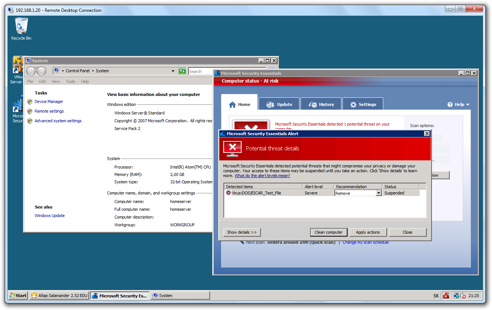

**UPDATE 25. 11. 2009**: [here][1] is a step-by-step tutorial for 64bit versions of Windows Server.

Even though not officially supported, Microsoft&#8217;s free antivirus [Security Essentials][2] installs and runs just fine on Windows Server 2008. You only have to trick it into thinking it&#8217;s Vista while installing.

The first challenge is downloading the installer. If you live in a country like Slovakia &#8211; when visiting the above URL, you&#8217;ll get redirected [here][3] (&#8220;You appear to be in a country or region where Microsoft Security Essentials is not available. Thank you for your interest in Microsoft Security Essentials.&#8221;). That sucks. But google cache is your friend: visit the website from google&#8217;s cache and download the thing from a link in the cached page. The download itself has no geoip restrictions.

The installer has two stages: the first stage unpacks the setup to your hard drive, the second one installs the real product. When you run the installer, it will tell you your operating system is not supported. No big deal: keep the setup running, find the unpacked files and copy them to a different location. Then close the setup and fire up [OllyDbg][4]. Load setup.exe in OllyDbg. Find all references to [GetVersionEx][5] function. Set a breakpoint on them. Run the setup. Anytime you hit the breakpoint, modify wProductType field in the returned [OSVERSIONINFOEX][6]: from VER\_NT\_SERVER (3) to VER\_NT\_WORKSTATION (1). You&#8217;ll have to to this a few times. After you get past the welcome screen, remove breakpoints, finish installing and you are done!

The setup would be much faster if Microsoft officially supported server version of Windows, but hell, it took me 10 minutes to figure this out and now I have a sleek and free antivirus on my test home server.

An obvious disclaimer: don&#8217;t do this on a production machine as this configuration was most probably not tested by Microsoft and may go berserk anytime.

And here is a proof:  

**UPDATE 24. 11. 2009**: Brett Wilhelm adapted these steps for use with [WinDbg][7]. You can follow his instructions if you are installing the 64bit version of Security Essentials. It will probably work with the 32bit version too and it&#8217;s easier than doing what I did above (he doesn&#8217;t edit the structure returned from GetVersionEx &#8211; instead he is patching the return value of RtlGetNtProductType called from GetVersionEx). Here is what he did to make it work:

> Using Windows Debugger with Symbols loaded:
> 
>   1. set breakpoint using &#8216;bp ntdll!RtlGetNtProductType+0x1A&#8217; in the command window.
>   2. Everytime this breakpoint is hit, modify the EAX CPU register (View -> Registers) to be 1 instead of 3
>   3. \*After\* you&#8217;ve passed the Windows Validation screen, run until you hit the breakpoint again then remove it (Edit -> Breakpoints).

Thanks Brett!

 [1]: http://migeel.sk/blog/2009/11/26/security-essentials-on-server-2008/
 [2]: http://www.microsoft.com/Security_Essentials/
 [3]: http://www.microsoft.com/Security_Essentials/market.aspx
 [4]: http://www.ollydbg.de/
 [5]: http://msdn.microsoft.com/en-us/library/ms724451(VS.85).aspx
 [6]: http://msdn.microsoft.com/en-us/library/ms724833(VS.85).aspx
 [7]: http://www.microsoft.com/whdc/DevTools/Debugging/default.mspx