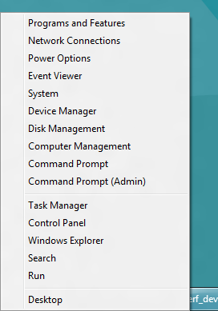

Now that Windows 8 Consumer Preview is out in public, you might have a hard time finding some of the old features you were using often &#8211; like the old Control Panel. Press WinKey + X.

You are welcome!