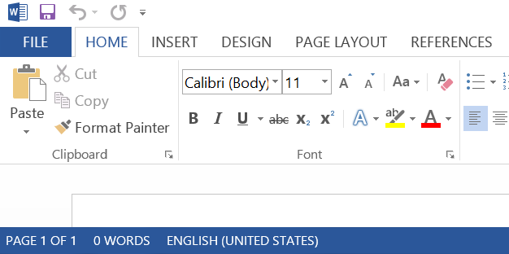
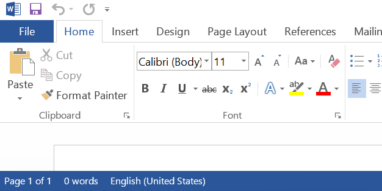

I got recently forced into installing Office 2013 on my computer at work. I was not a big fan of the ALL CAPS menus to begin with (and I&#8217;m really happy Visual Studio folks have a regkey to turn that Office plague off in their product), but it really surprised me just how OCD I became over OFFICE. I actually tried avoiding opening Outlook just so I don&#8217;t have to deal with EVERYTHING YELLING AT ME ALL THE TIME. The time was right to install Office 2013 at home and put on my reverse engineering hat.

# Can I make it lower case again?

I did a cursory search for some of the ribbon text strings in my Office installation and it didn&#8217;t take long to find the UTF-16 text strings in msointl.dll. Once I had that, I fired up Outlook under WinDBG and went looking for the spot where msointl.dll gets loaded. I set up a breakpoint on load by typing `sxe ld msointl.dll`, fired up the process and&#8230; breakpoint was not hit.

Well, maybe they load it as a data file. Restart, `bp kernelbase!LoadLibraryExW`, `g` , `g`, `g`,&#8230;. and bingo. Module loaded.

Once I had the string in the memory, I typed `s -su 0x0 L?0xFFFFFFFF "Send / Receive"` to find the exact address where the ribbon text was loaded. With an address in hand, it was easy to set up a memory access breakpoint (`ba r 1 address`) and start debugging.

I will spare you the details of how the text string gets copied and inspected a few times before it&#8217;s displayed (and how I had to set up new breakpoints to track the copies as well). It didn&#8217;t take long though to find the needle in the haystack &#8211; place where the breakpoint was hit with `LCMapStringEx` on the stack. It turns out Office calls this API with a hardcoded `LCMAP_UPPERCASE` constant. Locate the `push` instruction in memory, modify 02 to 00, hit F5. Blam, menu looks as pretty as in Office 2010. 

Running Office under WinDBG is not very practical, so I decided I will write a small app for this.

# Introducing unOFFIC

I could opt to just patch mso.dll, but that&#8217;s hardly practical in the world of software updates and digital signatures. Instead I decided to write a memory patch. This would be really trivial had the code to patch been loaded at the time of process startup. Unfortunately, mso.dll is delay loaded. Hence, the usual trick where you CreateProcess a suspended process, patch memory and resume main thread won&#8217;t work. I had to write a small debugger. It is the same amount of fun as it sounds :).

The debugging APIs made things really simple, since they give you a notification when a DLL gets loaded and that&#8217;s exactly when we should go and patch that bit in mso.dll.

The last problem was to hook it up so that Office apps always launch under my debugger. I came up with hardly an elegant solution, but works for me &#8211; [Image File Execution Options][1]. It might break some programs that try to run Office apps programmatically and do interprocess communication afterwards (or wait for them to exit), but that&#8217;s a small price to pay for a consistent user experience (the Word previewer in Outlook is affected, for example).

Once I had a way to hook it up at launch, I just decided to go the last mile and write an MSI installer with a complimentary microsite at [unoffic.migeel.sk][2]. The link to get the sources is included as well. Enjoy!

Obligatory before and after pics:

 [1]: http://blogs.msdn.com/b/greggm/archive/2005/02/21/377663.aspx
 [2]: http://unoffic.migeel.sk