> NOTE: This article captures a point in time in the past. While the general information is still correct, the CoreRT project got folded into [Native AOT publishing](https://learn.microsoft.com/dotnet/core/deploying/native-aot/) in .NET 7 and is now a supported part of .NET. The information about sizes is no longer accurate (and much better), neither is the information about support for dynamic code (both interpreter and JIT are unsupported).

As someone who grew up in the times of 1.44 MB floppy disks and 56 kbit modems, I've always liked small programs. I could fit many small programs on a floppy disk I carried with me. If a program couldn't fit on my floppy disk, I started thinking about why - does it have a lot of graphics? Is there music? Can the program do many complex things? Or is it simply _bloated_?

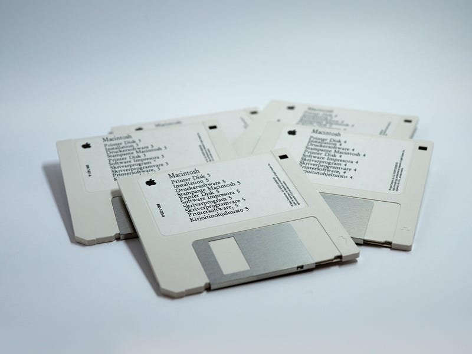

These days, disk space became so cheap (and huge flashdrives so ubiquitous) that people gave up on optimizing for size.

One place where size still matters is transfers: when transferring a program over a wire, megabytes equate to seconds. A fast 100 MBit connection can only push through 12 megabytes per second in the best case. If on the other end of the wire is a person waiting for a download to finish, the difference between five seconds and one second can have meaningful impact on their experience.

The person could be exposed to the transfer times either directly (user is downloading a program over network), or indirectly (a serverless service is getting deployed to respond to a web request).

People typically perceive anything faster than 0.1 seconds as instant, 3.0 seconds is about the limit for user's flow to stay uninterrupted, and you would have a hard time to keep the user engaged after 10 seconds.

> While smaller is not essential anymore, it's still _better_.

This article came out as an experiment to find out just how small a useful self-contained C# executable can be. Can C# apps hit the sizes where users would consider the download times _instant_? Would it enable C# to be used in places where it isn't used right now?

# What exactly is "self-contained"?

A self-contained application is an application that includes everything that's necessary for it to run on a vanilla installation of the operating system.

The C# compiler belongs to a group of compilers targeting a virtual machine (Java and Kotlin being another notable members of the group): the output of the C# compiler is an executable that requires some sort of virtual machine (VM) to execute. One can't just install a barebone operating system and expect to be able to run programs produced by the C# compiler on it.

At least on Windows, it used to be the case that one could rely on a machine-wide installation of the .NET Framework to run the outputs of the C# compiler. Nowadays there are many Windows SKUs that no longer carry the framework with it (IoT, Nano Server, ARM64,…). .NET Framework also doesn't support the latest enhancements to the C# language. It's kind of on its way out.

For a C# app to be self-contained, it needs to include the runtime and all the class libraries it uses. It's a lot of stuff to fit into the 8 kB that we budget for!

# The 8 kB game

We're going to build a clone of the Snake game. Here's the finished product:

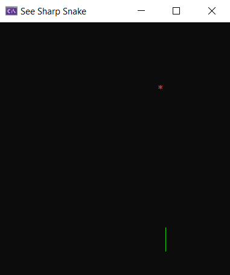

If you're not interested in the game mechanics, feel free to skip over to the interesting parts where we shrink the game from **65 megabytes** to **8 kilobytes** in 9 steps (scroll down to where you see graphs).

The game will run in text mode and we'll use the box drawing characters to draw the snake. I'm sure Vulcan or DirectX would be a lot more fun, but we'll get by with `System.Console`.

# A no-allocation game

We're going to build a no-allocation game - and by no-allocation I don't mean the "don't allocate in the game loop" that is common among C# game devs. I mean "the new keyword with reference types is forbidden in the entire codebase". The reasons for that will become apparent at the final stretch of shrinking the game.

With such restriction in place, one might wonder if there's any point in using C# after all: without the new keyword, we won't be using the garbage collector, we can't throw exceptions, etc. - a language like C would work just as well.

One reason to use C# is "because we can". The other reason is testability and code sharing - while the game as a whole is no-allocation, it doesn't mean that parts of it couldn't be reused in a different project that doesn't have such constrains. For example, parts of the game could be included from an xUnit project to get unit test coverage. If one chooses C to build the game, things have to stay constrained by what C can do even when the code is reused from elsewhere. But since C# provides a good mix of high level and low level constructs, we can follow the "_high level by default, low level when necessary_" philosophy.

To reach the 8 kB deployment size, the low level part will be necessary.

# The game structure

Let's start with a struct that represents the frame buffer. Frame buffer is a component that holds the pixels (or in this case characters) to be drawn to the screen.

```csharp
unsafe struct FrameBuffer
{
    public const int Width = 40;
    public const int Height = 20;
    public const int Area = Width * Height;

    fixed char _chars[Area];

    public void SetPixel(int x, int y, char character)
    {
        _chars[y * Width + x] = character;
    }

    public void Clear()
    {
        for (int i = 0; i < Area; i++)
            _chars[i] = ' ';
    }

    public readonly void Render()
    {
        Console.SetCursorPosition(0, 0);

        const ConsoleColor snakeColor = ConsoleColor.Green;

        Console.ForegroundColor = snakeColor;

        for (int i = 1; i <= Area; i++)
        {
            char c = _chars[i - 1];

            if (c == '*' || (c >= 'A' && c <= 'Z') || (c >= 'a' && c <= 'z'))
            {
                Console.ForegroundColor = c == '*' ? ConsoleColor.Red : ConsoleColor.White;
                Console.Write(c);
                Console.ForegroundColor = snakeColor;
            }
            else
                Console.Write(c);

            if (i % Width == 0)
            {
                Console.SetCursorPosition(0, i / Width - 1);
            }
        }
    }
}
```

We provide methods to set individual pixels, clear the frame buffer, and to render the contents of the frame buffer into `System.Console`. The rendering step special cases a couple characters so that we get colorful output without having to keep track of color for each pixel of the frame buffer.

One interesting thing to call out is the `fixed char _chars[Area]` field: this is the C# syntax to declare a [fixed array](https://docs.microsoft.com/en-us/dotnet/csharp/programming-guide/unsafe-code-pointers/fixed-size-buffers). A fixed array is an array whose individual elements are a part of the struct. You can think of it as a shortcut for a set of fields `char _char_0, _char_1, _char_2, _char_3,... _char_Area` that one can access as an array. The size of this array needs to be a compile time constant so that the size of the entire struct is fixed.

We can't go overboard with the size of a fixed array because being a part of a struct, the array needs to live on the stack and stacks tend to be limited to a small number of bytes (1 MB per thread, typically). But 40 * 20 * 2 bytes (width * height * sizeof(char)) should be fine.

Next thing we need is a random number generator. The one that comes with .NET is a reference type (for good reasons!) and we forbid ourselves the new keyword - we can't use it. A simple struct will do:

```csharp
struct Random
{
    private uint _val;

    public Random(uint seed)
    {
        _val = seed;
    }

    public uint Next() => _val = (1103515245 * _val + 12345) % 2147483648;
}
```

This random number generator is not great, but we don't need anything sophisticated.

Now we only need something that wraps the snake logic. Time for a Snake struct:

```csharp
struct Snake
{
    public const int MaxLength = 30;

    private int _length;

    // Body is a packed integer that packs the X coordinate, Y coordinate, and the character
    // for the snake's body.
    // Only primitive types can be used with C# `fixed`, hence this is an `int`.
    private unsafe fixed int _body[MaxLength];

    private Direction _direction;
    private Direction _oldDirection;

    public Direction Course
    {
        set
        {
            if (_oldDirection != _direction)
                _oldDirection = _direction;

            if (_direction - value != 2 && value - _direction != 2)
                _direction = value;
        }
    }

    public unsafe Snake(byte x, byte y, Direction direction)
    {
        _body[0] = new Part(x, y, DirectionToChar(direction, direction)).Pack();
        _direction = direction;
        _oldDirection = direction;
        _length = 1;
    }

    public unsafe bool Update()
    {
        Part oldHead = Part.Unpack(_body[0]);
        Part newHead = new Part(
            (byte)(_direction switch
            {
                Direction.Left => oldHead.X == 0 ? FrameBuffer.Width - 1 : oldHead.X - 1,
                Direction.Right => (oldHead.X + 1) % FrameBuffer.Width,
                _ => oldHead.X,
            }),
            (byte)(_direction switch
            {
                Direction.Up => oldHead.Y == 0 ? FrameBuffer.Height - 1 : oldHead.Y - 1,
                Direction.Down => (oldHead.Y + 1) % FrameBuffer.Height,
                _ => oldHead.Y,
            }),
            DirectionToChar(_direction, _direction)
            );

        oldHead = new Part(oldHead.X, oldHead.Y, DirectionToChar(_oldDirection, _direction));

        bool result = true;

        for (int i = 0; i < _length - 1; i++)
        {
            Part current = Part.Unpack(_body[i]);
            if (current.X == newHead.X && current.Y == newHead.Y)
                result = false;
        }

        _body[0] = oldHead.Pack();

        for (int i = _length - 2; i >= 0; i--)
        {
            _body[i + 1] = _body[i];
        }

        _body[0] = newHead.Pack();

        _oldDirection = _direction;

        return result;
    }

    public unsafe readonly void Draw(ref FrameBuffer fb)
    {
        for (int i = 0; i < _length; i++)
        {
            Part p = Part.Unpack(_body[i]);
            fb.SetPixel(p.X, p.Y, p.Character);
        }
    }

    public bool Extend()
    {
        if (_length < MaxLength)
        {
            _length += 1;
            return true;
        }
        return false;
    }

    public unsafe readonly bool HitTest(int x, int y)
    {
        for (int i = 0; i < _length; i++)
        {
            Part current = Part.Unpack(_body[i]);
            if (current.X == x && current.Y == y)
                return true;
        }

        return false;
    }

    private static char DirectionToChar(Direction oldDirection, Direction newDirection)
    {
        const string DirectionChangeToChar = "│┌?┐┘─┐??└│┘└?┌─";
        return DirectionChangeToChar[(int)oldDirection * 4 + (int)newDirection];
    }

    // Helper struct to pack and unpack the packed integer in _body.
    readonly struct Part
    {
        public readonly byte X, Y;
        public readonly char Character;

        public Part(byte x, byte y, char c)
        {
            X = x;
            Y = y;
            Character = c;
        }

        public int Pack() => X << 24 | Y << 16 | Character;
        public static Part Unpack(int packed) => new Part((byte)(packed >> 24), (byte)(packed >> 16), (char)packed);
    }

    public enum Direction
    {
        Up, Right, Down, Left
    }
}
```

The state that a snake needs to track is:

* the coordinates of each pixel that represents the snake's body,
* the current length of the snake,
* the current direction of the snake,
* past direction of the snake (in case we need to draw the "bend" character instead of a straight line)

The snake provides methods to Extend the length of snake by one (returns false if the snake is already at full length), to HitTest a pixel with the snake's body, to Draw the snake into a FrameBuffer and to Update the snake's position as a response to a game tick (returns false if the snake ate itself). There's also a property to set the current Course of the snake.

We use the same fixed array trick that we used in the frame buffer to keep the snake no-allocation. It means the maximum length of the snake has to be a compile time constant.

The last thing we need is the game loop:

```csharp
struct Game
{
    enum Result
    {
        Win, Loss
    }

    private Random _random;

    private Game(uint randomSeed)
    {
        _random = new Random(randomSeed);
    }

    private Result Run(ref FrameBuffer fb)
    {
        Snake s = new Snake(
            (byte)(_random.Next() % FrameBuffer.Width),
            (byte)(_random.Next() % FrameBuffer.Height),
            (Snake.Direction)(_random.Next() % 4));

        MakeFood(s, out byte foodX, out byte foodY);

        long gameTime = Environment.TickCount64;

        while (true)
        {
            fb.Clear();

            if (!s.Update())
            {
                s.Draw(ref fb);
                return Result.Loss;
            }

            s.Draw(ref fb);

            if (Console.KeyAvailable)
            {
                ConsoleKeyInfo ki = Console.ReadKey(intercept: true);
                switch (ki.Key)
                {
                    case ConsoleKey.UpArrow:
                        s.Course = Snake.Direction.Up; break;
                    case ConsoleKey.DownArrow:
                        s.Course = Snake.Direction.Down; break;
                    case ConsoleKey.LeftArrow:
                        s.Course = Snake.Direction.Left; break;
                    case ConsoleKey.RightArrow:
                        s.Course = Snake.Direction.Right; break;
                }
            }

            if (s.HitTest(foodX, foodY))
            {
                if (s.Extend())
                    MakeFood(s, out foodX, out foodY);
                else
                    return Result.Win;
            }

            fb.SetPixel(foodX, foodY, '*');

            fb.Render();

            gameTime += 100;

            long delay = gameTime - Environment.TickCount64;
            if (delay >= 0)
                Thread.Sleep((int)delay);
            else
                gameTime = Environment.TickCount64;
        }
    }

    void MakeFood(in Snake snake, out byte foodX, out byte foodY)
    {
        do
        {
            foodX = (byte)(_random.Next() % FrameBuffer.Width);
            foodY = (byte)(_random.Next() % FrameBuffer.Height);
        }
        while (snake.HitTest(foodX, foodY));
    }

    static void Main()
    {
        Console.SetWindowSize(FrameBuffer.Width, FrameBuffer.Height);
        Console.SetBufferSize(FrameBuffer.Width, FrameBuffer.Height);
        Console.Title = "See Sharp Snake";
        Console.CursorVisible = false;

        FrameBuffer fb = new FrameBuffer();

        while (true)
        {
            Game g = new Game((uint)Environment.TickCount64);
            Result result = g.Run(ref fb);

            string message = result == Result.Win ? "You win" : "You lose";

            int position = (FrameBuffer.Width - message.Length) / 2;
            for (int i = 0; i < message.Length; i++)
            {
                fb.SetPixel(position + i, FrameBuffer.Height / 2, message[i]);
            }

            fb.Render();

            Console.ReadKey(intercept: true);
        }
    }
}
```

We use the random number generator to generate a random position and direction of the snake, we randomly place the food on the game surface, making sure it doesn't overlap the snake, and start the game loop.

Within the game loop we ask the snake to update its position and check whether it ate itself. We then draw the snake, check the keyboard for input, hit-test the snake with the food, and render everything to the console.

That's pretty much it. Let's see where we are in terms of size.

# The default size of a .NET Core 3.0 Snake

I've placed the game in [a GitHub repo](https://github.com/MichalStrehovsky/SeeSharpSnake) so that you can follow along. The project file will produce the game in different configurations depending on the Mode property passed to publish. To produce the default configuration with CoreCLR, run:

```sh
$ dotnet publish -r win-x64 -c Release
```

This will produce a single EXE file that has whopping 65 MB. The produced EXE includes the game, the .NET Runtime, and the base class libraries that are the standard part of .NET. You might say "still better than Electron" and call it good, but let's see if we can do better.

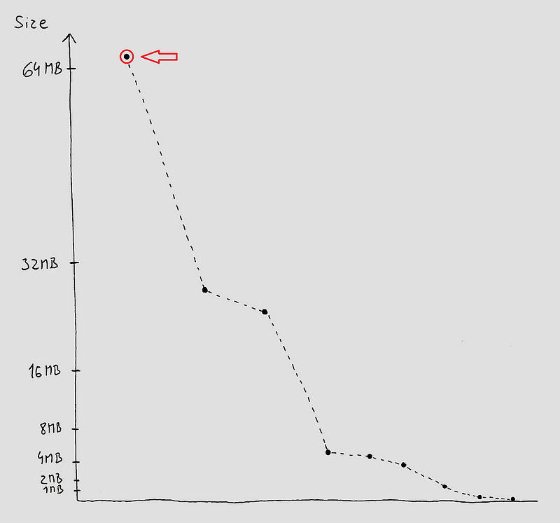

# IL Trimming

IL trimming shipped with .NET Core 3.0 - trimming removes unused code from your app by scanning the entire program and removing assemblies that are unreferenced. To use it with the project, pass a PublishTrimmed property to publish. Like so:

```sh
$ dotnet publish -r win-x64 -c Release /p:PublishTrimmed=true
```

With this setting, the game shrinks to 25 MB. It's a nice 60% reduction, but far from our 8 kB goal.

Trimming has more aggressive settings that are not publicly exposed and they could bring this down further, but in the end, we're going to be limited by the size of the CoreCLR runtime itself - coreclr.dll - at 5.3 MB. We might have reached a dead end on the road to a 8 kB game.

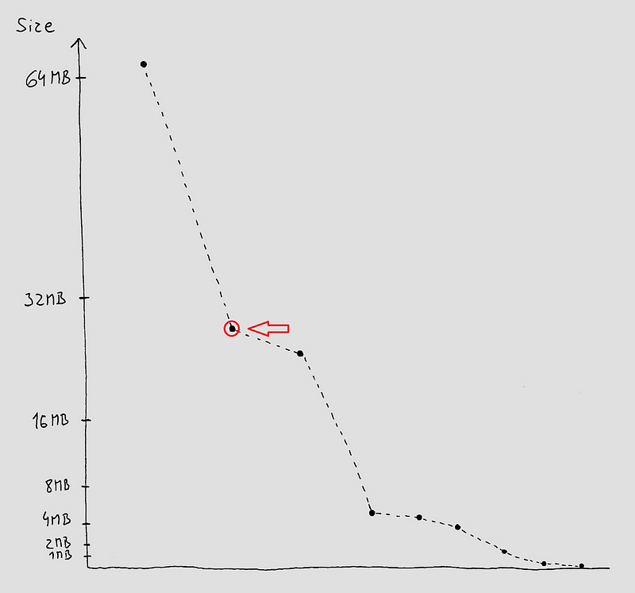

# Slight detour: Mono

[Mono](https://www.mono-project.com/) is another .NET runtime that for many is the synonym for Xamarin. To build a single executable with the C# snake, we can use the mkbundle tool that comes with Mono:

```sh
$ mkbundle SeeSharpSnake.dll --simple -o SeeSharpSnake.exe
```

This will produce a 12.3 MB executable that depends on mono-2.0-sgen.dll that itself has 5.9 MB - so we're looking at 18.2 MB in total. When trying to launch it, I hit "Error mapping file: mono_file_map_error failed", but I'm going to trust that except for this bug, things would work with Mono and the result would be 18.2 MB.

Unlike CoreCLR, Mono also depends on the Visual C++ runtime redistributable library that is not available in a default Windows installation: to keep the goal of the app being self-contained, we need to carry this library with the app. This increases the footprint of the application by another megabyte or so.

We would likely be able to make things smaller by adding trimming to the mix, but we're going to hit the same problem as with CoreCLR - the size of the runtime (mono-2.0-sgen.dll) is 5.9 MB (plus the size of the C++ runtime libraries on top of it), and represents the floor of where any possible IL-level optimization could bring us.

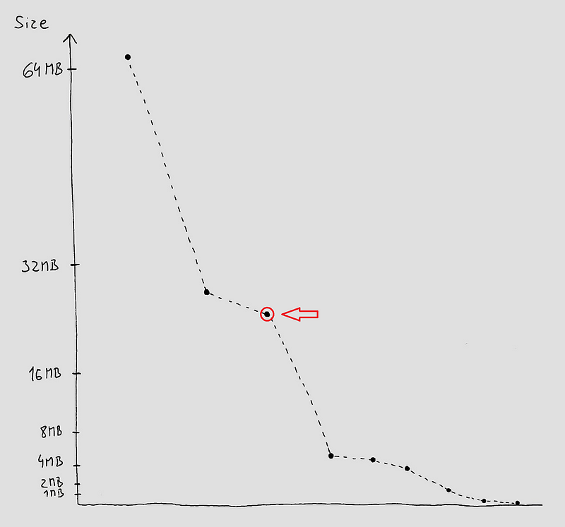

# Can we take the runtime out?

It is clear that to get anywhere near the 8 kB goal, we need to take the runtime out of the app. The only .NET runtime where this is possible is [CoreRT](https://github.com/dotnet/corert). While it's common to call CoreRT a "runtime", it's closer to being a "runtime library". It's not a virtual machine like CoreCLR or Mono - the CoreRT's runtime is just a set of functions that support ahead of time generated native code produced by CoreRT's ahead of time compiler.

CoreRT comes with _libraries_ that make CoreRT look like any other .NET runtime: there's a library that adds GC, library that adds support for reflection, library that adds a JIT, library that adds an interpreter, etc. But all of those libraries are _optional_ (and that includes the GC).

More on how CoreRT differs from CoreCLR and Mono is in [this article](). When I was reading about the runtime of the [D language](https://theartofmachinery.com/2017/06/04/what_is_the_d_runtime.html), it reminded me of CoreRT a lot. The article is an interesting read too.

Let's see where we're with the default CoreRT configuration:

```sh
$ dotnet publish -r win-x64 -c Release /p:Mode=CoreRT
```

This comes down to 4.7 MB. It's the smallest so far, but still not good enough.

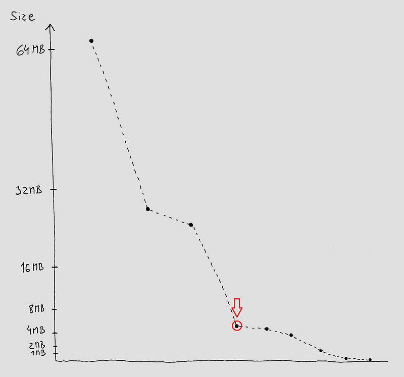

The CoreRT ahead of time compiler offers a [vast number](http://aka.ms/OptimizeCoreRT) of settings that affect code generation. By default, the compiler tries to maximize the generated code speed and compatibility with other .NET runtimes at the expense of the size of the generated executable.

The compiler has a built-in trimmer that removes unused code. The "CoreRT-Moderate" setting that we define in the Snake project relaxes one of the restrictions on removing unused code that allows more removal. We also ask the compiler to trade program speed for some extra bytes. Most .NET programs would work just fine in this mode.

```sh
$ dotnet publish -r win-x64 -c Release /p:Mode=CoreRT-Moderate
```

We're now at 4.3 MB.

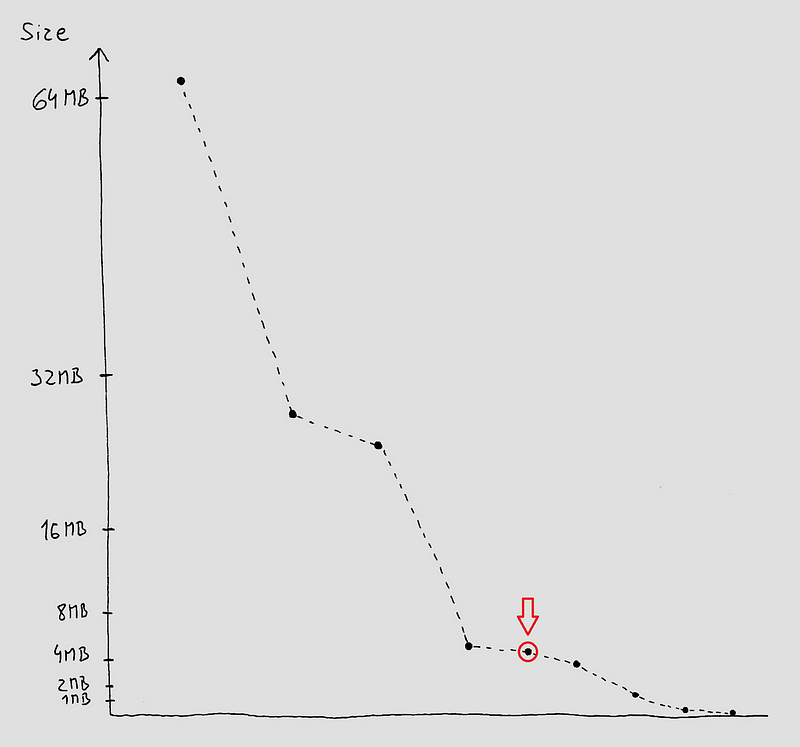

# Turning on high savings in CoreRT

I've grouped a couple more compilation options into a "high savings" mode. This mode is going to remove support for things that many apps would notice, but Snake (being the low level thing that it is) won't.

We are going to remove:

* Stack trace data for framework implementation details
* Exception messages in framework-thrown exceptions
* Support for non-English locales
* EventSource instrumentation

```sh
$ dotnet publish -r win-x64 -c Release /p:Mode=CoreRT-High
```

We've reached 3.0 MB. This is 5% of what we started with, but CoreRT has one more trick up its sleeve.

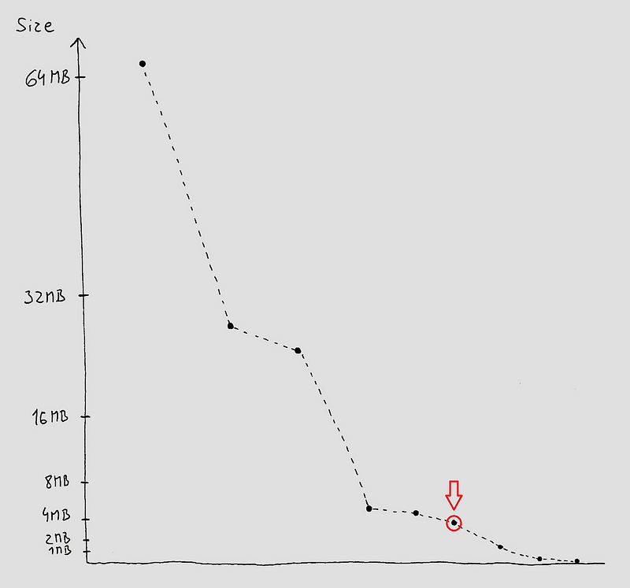

# Disabling reflection

Substantial part of the CoreRT runtime libraries is dedicated to the implementation of the .NET reflection surface area. Because CoreRT is an ahead-of-time-compiled runtime-library-based .NET implementation, it doesn't need most of the data structures a typical VM-based runtime (like CoreCLR and Mono) needs. This data includes things like names of types, methods, signatures, base types, etc. CoreRT embeds this data because programs using .NET reflection need it, but not because it's needed for the runtime to operate. I call this data "the reflection tax", because that's what it is for the runtime.

CoreRT supports a [reflection-free mode](https://github.com/dotnet/corert/blob/master/Documentation/using-corert/reflection-free-mode.md) that avoids this tax. You might feel that a lot of .NET code wouldn't work without reflection and you might be right, but a surprising amount of things do work: Gui.cs, System.IO.Pipelines, or even a basic WinForms app. Snake will definitely work, so let's turn this mode on:

```sh
$ dotnet publish -r win-x64 -c Release /p:Mode=CoreRT-ReflectionFree
```

We're now at 1.2 MB. The reflection tax is a pretty heavy tax!

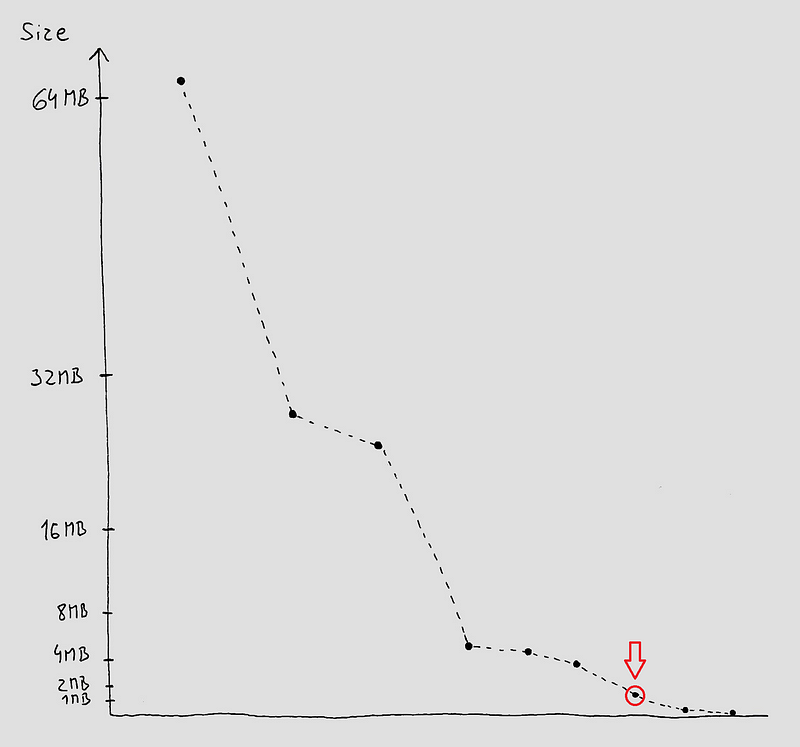

# Getting our hands dirty

Now we've reached the end of what's possible with the .NET SDK and we need to get our hands dirty. What we're going to do now is starting to be ridiculous and I wouldn't expect anyone else to do this. We're going to rely on the implementation details of the CoreRT compiler and runtime.

As we saw earlier, CoreRT is a set of runtime libraries coupled with an ahead of time compiler. What if we replace the runtime libraries with a minimal reimplementation? We've decided not to use the garbage collector and that makes this job much more feasible.

Let's start with the easy things:

```csharp
namespace System.Threading
{
    static class Thread
    {
        [DllImport("api-ms-win-core-synch-l1-2-0")]
        public static extern void Sleep(int delayMs);
    }
}

namespace System
{
    static class Environment
    {
        [DllImport("api-ms-win-core-sysinfo-l1-1-0")]
        private static extern long GetTickCount64();

        public static long TickCount64 => GetTickCount64();
    }
}
```

There - we just reimplemented `Thread.Sleep` and `Environment.TickCount64` (for Windows) while avoiding all dependencies on the existing runtime library.

Let's do the same for the subset of `System.Console` that the game uses:

```csharp
namespace System
{
    static class Console
    {
        private enum BOOL : int
        {
            FALSE = 0,
            TRUE = 1,
        }

        [DllImport("api-ms-win-core-processenvironment-l1-1-0")]
        private static unsafe extern IntPtr GetStdHandle(int c);

        private readonly static IntPtr s_outputHandle = GetStdHandle(-11);

        private readonly static IntPtr s_inputHandle = GetStdHandle(-10);

        [DllImport("api-ms-win-core-console-l2-1-0.dll", EntryPoint = "SetConsoleTitleW")]
        private static unsafe extern BOOL SetConsoleTitle(char* c);
        public static unsafe string Title
        {
            set
            {
                fixed (char* c = value)
                    SetConsoleTitle(c);
            }
        }

        [StructLayout(LayoutKind.Sequential)]
        struct CONSOLE_CURSOR_INFO
        {
            public uint Size;
            public BOOL Visible;
        }

        [DllImport("api-ms-win-core-console-l2-1-0")]
        private static unsafe extern BOOL SetConsoleCursorInfo(IntPtr handle, CONSOLE_CURSOR_INFO* cursorInfo);

        public static unsafe bool CursorVisible
        {
            set
            {
                CONSOLE_CURSOR_INFO cursorInfo = new CONSOLE_CURSOR_INFO
                {
                    Size = 1,
                    Visible = value ? BOOL.TRUE : BOOL.FALSE
                };
                SetConsoleCursorInfo(s_outputHandle, &cursorInfo);
            }
        }

        [DllImport("api-ms-win-core-console-l2-1-0")]
        private static unsafe extern BOOL SetConsoleTextAttribute(IntPtr handle, ushort attribute);

        public static ConsoleColor ForegroundColor
        {
            set
            {
                SetConsoleTextAttribute(s_outputHandle, (ushort)value);
            }
        }

        [StructLayout(LayoutKind.Sequential)]
        private struct KEY_EVENT_RECORD
        {
            public BOOL KeyDown;
            public short RepeatCount;
            public short VirtualKeyCode;
            public short VirtualScanCode;
            public short UChar;
            public int ControlKeyState;
        }

        [StructLayout(LayoutKind.Sequential)]
        private struct INPUT_RECORD
        {
            public short EventType;
            public KEY_EVENT_RECORD KeyEvent;
        }

        [DllImport("api-ms-win-core-console-l1-2-0", EntryPoint = "PeekConsoleInputW", CharSet = CharSet.Unicode)]
        private static unsafe extern BOOL PeekConsoleInput(IntPtr hConsoleInput, INPUT_RECORD* lpBuffer, uint nLength, uint* lpNumberOfEventsRead);

        public static unsafe bool KeyAvailable
        {
            get
            {
                uint nRead;
                INPUT_RECORD buffer;
                while (true)
                {
                    PeekConsoleInput(s_inputHandle, &buffer, 1, &nRead);

                    if (nRead == 0)
                        return false;

                    if (buffer.EventType == 1 && buffer.KeyEvent.KeyDown != BOOL.FALSE)
                        return true;

                    ReadConsoleInput(s_inputHandle, &buffer, 1, &nRead);
                }
            }
        }

        [DllImport("api-ms-win-core-console-l1-2-0", EntryPoint = "ReadConsoleInputW", CharSet = CharSet.Unicode)]
        private static unsafe extern BOOL ReadConsoleInput(IntPtr hConsoleInput, INPUT_RECORD* lpBuffer, uint nLength, uint* lpNumberOfEventsRead);

        public static unsafe ConsoleKeyInfo ReadKey(bool intercept)
        {
            uint nRead;
            INPUT_RECORD buffer;
            do
            {
                ReadConsoleInput(s_inputHandle, &buffer, 1, &nRead);
            }
            while (buffer.EventType != 1 || buffer.KeyEvent.KeyDown == BOOL.FALSE);

            return new ConsoleKeyInfo((char)buffer.KeyEvent.UChar, (ConsoleKey)buffer.KeyEvent.VirtualKeyCode, false, false, false);
        }

        struct SMALL_RECT
        {
            public short Left, Top, Right, Bottom;
        }

        [DllImport("api-ms-win-core-console-l2-1-0")]
        private static unsafe extern BOOL SetConsoleWindowInfo(IntPtr handle, BOOL absolute, SMALL_RECT* consoleWindow);

        public static unsafe void SetWindowSize(int x, int y)
        {
            SMALL_RECT rect = new SMALL_RECT
            {
                Left = 0,
                Top = 0,
                Right = (short)(x - 1),
                Bottom = (short)(y - 1),
            };
            SetConsoleWindowInfo(s_outputHandle, BOOL.TRUE, &rect);
        }

        [StructLayout(LayoutKind.Sequential)]
        struct COORD
        {
            public short X, Y;
        }

        [DllImport("api-ms-win-core-console-l2-1-0")]
        private static unsafe extern BOOL SetConsoleScreenBufferSize(IntPtr handle, COORD size);

        public static void SetBufferSize(int x, int y)
        {
            SetConsoleScreenBufferSize(s_outputHandle, new COORD { X = (short)x, Y = (short)y });
        }

        [DllImport("api-ms-win-core-console-l2-1-0")]
        private static unsafe extern BOOL SetConsoleCursorPosition(IntPtr handle, COORD position);

        public static void SetCursorPosition(int x, int y)
        {
            SetConsoleCursorPosition(s_outputHandle, new COORD { X = (short)x, Y = (short)y });
        }

        [DllImport("api-ms-win-core-console-l1-2-0", EntryPoint = "WriteConsoleW")]
        private static unsafe extern BOOL WriteConsole(IntPtr handle, void* buffer, int numChars, int* charsWritten, void* reserved);

        public static unsafe void Write(char c)
        {
            int dummy;
            WriteConsole(s_outputHandle, &c, 1, &dummy, null);
        }
    }
}
```

Let's rebuild the game with this replacement framework:

```sh
$ dotnet publish -r win-x64 -c Release /p:Mode=CoreRT-ReflectionFree /p:IncludePal=true
```

Unsurprisingly, this didn't save us much. The APIs we're replacing are already relatively lightweight, and rewriting them only gains a couple kilobytes that are not worth mentioning. But this is an important stepping stone to the last step in our journey.

# Replacing all runtime libraries

The remaining 1.2 MB of code and data in the Snake game is there to support things we don't see, but are there - ready in case we need them. There's the garbage collector, support for exception handling, the code to format and print stack traces to the console when an unhandled exception happens, and many other things that are "under the hood".

The compiler could detect that none of this is needed and avoid generating them, but what we're trying to do is so weird that it's not worth adding compiler features to support it. The way to avoid it is to simply provide an alternative runtime library.

Let's start with redefining a minimal version of the base types:

```csharp
namespace System
{
    public class Object
    {
        // The layout of object is a contract with the compiler.
        public IntPtr m_pEEType;
    }
    public struct Void { }

    // The layout of primitive types is special cased because it would be recursive.
    // These really don't need any fields to work.
    public struct Boolean { }
    public struct Char { }
    public struct SByte { }
    public struct Byte { }
    public struct Int16 { }
    public struct UInt16 { }
    public struct Int32 { }
    public struct UInt32 { }
    public struct Int64 { }
    public struct UInt64 { }
    public struct IntPtr { }
    public struct UIntPtr { }
    public struct Single { }
    public struct Double { }

    public abstract class ValueType { }
    public abstract class Enum : ValueType { }

    public struct Nullable<T> where T : struct { }
    
    public sealed class String
    {
        // The layout of the string type is a contract with the compiler.
        public readonly int Length;
        public char _firstChar;

        public unsafe char this[int index]
        {
            [System.Runtime.CompilerServices.Intrinsic]
            get
            {
                return Internal.Runtime.CompilerServices.Unsafe.Add(ref _firstChar, index);
            }
        }
    }
    public abstract class Array { }
    public abstract class Delegate { }
    public abstract class MulticastDelegate : Delegate { }

    public struct RuntimeTypeHandle { }
    public struct RuntimeMethodHandle { }
    public struct RuntimeFieldHandle { }

    public class Attribute { }
}

namespace System.Runtime.CompilerServices
{
    internal sealed class IntrinsicAttribute : Attribute { }

    public class RuntimeHelpers
    {
        public static unsafe int OffsetToStringData => sizeof(IntPtr) + sizeof(int);
    }
}

namespace System.Runtime.InteropServices
{
    public enum CharSet
    {
        None = 1,
        Ansi = 2,
        Unicode = 3,
        Auto = 4,
    }

    public sealed class DllImportAttribute : Attribute
    {
        public string EntryPoint;
        public CharSet CharSet;
        public DllImportAttribute(string dllName) { }
    }

    public enum LayoutKind
    {
        Sequential = 0,
        Explicit = 2,
        Auto = 3,
    }

    public sealed class StructLayoutAttribute : Attribute
    {
        public StructLayoutAttribute(LayoutKind layoutKind) { }
    }
}
namespace Internal.Runtime.CompilerServices
{
    public static unsafe partial class Unsafe
    {
        // The body of this method is generated by the compiler.
        // It will do what Unsafe.Add is expected to do. It's just not possible to express it in C#.
        [System.Runtime.CompilerServices.Intrinsic]
        public static extern ref T Add<T>(ref T source, int elementOffset);
    }
}

```

At this point let's forgo the project file and dotnet CLI and launch the individual tools directly. We start by launching the C# compiler (CSC). I recommend launching these commands from the "x64 Native Tools Command Prompt for VS 2019" - it's in your Start menu if you have Visual Studio installed. The right version of tools is on the PATH in that window.

The /noconfig, /nostdlib, and /runtimemetadataversion are the magic switches needed to compile something that defines System.Object. I chose the .ilexe file extension instead of .exe because .exe will be used for the finished product.

```sh
$ csc.exe /debug /O /noconfig /nostdlib /runtimemetadataversion:v4.0.30319 MiniBCL.cs Game\FrameBuffer.cs Game\Random.cs Game\Game.cs Game\Snake.cs Pal\Thread.Windows.cs Pal\Environment.Windows.cs Pal\Console.Windows.cs /out:zerosnake.ilexe /langversion:latest /unsafe
```

This will successfully compile the IL bytecode version of the game with the C# compiler. We still need some sort of runtime to execute it.

Let's try to feed this to the CoreRT ahead of time compiler to generate native code from the IL. If you followed the steps above, you'll find ilc.exe, the CoreRT ahead of time compiler, in your NuGet package cache (somewhere like %USERPROFILE%\.nuget\packages\runtime.win-x64.microsoft.dotnet.ilcompiler\1.0.0-alpha-27402–01\Tools).

```sh
$ ilc.exe zerosnake.ilexe -o zerosnake.obj --systemmodule zerosnake --Os -g
```

This is going to crash with "Expected type ‘Internal.Runtime.CompilerHelpers.StartupCodeHelpers' not found in module ‘zerosnake'". Turns out that besides the obvious minimum that a managed developer would expect, there's also a minimum that the CoreRT compiler needs to compile the input.

Let's skip to the chase and add what's needed:

```csharp
namespace Internal.Runtime.CompilerHelpers
{
    // A class that the compiler looks for that has helpers to initialize the
    // process. The compiler can gracefully handle the helpers not being present,
    // but the class itself being absent is unhandled. Let's add an empty class.
    class StartupCodeHelpers
    {
    }
}

namespace System
{
    // A special type that the compiler uses to implement generic interfaces
    // (e.g. IEnumerable<T>) on arrays. Our arrays won't implement any generic interfaces.
    class Array<T> : Array { }
}

namespace System.Runtime.InteropServices
{
    // Custom attribute that marks a class as having special "Call" intrinsics.
    // The compiler has special logic handling types with this attribute.
    internal class McgIntrinsicsAttribute : Attribute { }
}

namespace System.Runtime.CompilerServices
{
    // A class responsible for running static constructors. The compiler will call into this
    // code to ensure static constructors run and that they only run once.
    [System.Runtime.InteropServices.McgIntrinsics]
    internal static class ClassConstructorRunner
    {
        private static unsafe IntPtr CheckStaticClassConstructionReturnNonGCStaticBase(ref StaticClassConstructionContext context, IntPtr nonGcStaticBase)
        {
            CheckStaticClassConstruction(ref context);
            return nonGcStaticBase;
        }

        private static unsafe void CheckStaticClassConstruction(ref StaticClassConstructionContext context)
        {
            // Very simplified class constructor runner. In real world, the class constructor runner
            // would need to be able to deal with potentially multiple threads racing to initialize
            // a single class, and would need to be able to deal with potential deadlocks
            // between class constructors.

            // If the class is already initialized, we're done.
            if (context.initialized == 1)
                return;

            // Mark the class as initialized.
            context.initialized = 1;

            // Run the class constructor.
            Call<int>(context.cctorMethodAddress);
        }

        // This is a special compiler intrinsic that calls the method pointed to by pfn.
        // The compiler generates code for this and we can just mark it `extern`.
        // Once C# gets proper function pointer support (planned for C# 9), this won't be needed.
        [System.Runtime.CompilerServices.Intrinsic]
        private static extern T Call<T>(System.IntPtr pfn);
    }

    // This data structure is a contract with the compiler. It holds the address of a static
    // constructor and a flag that specifies whether the constructor already executed.
    [System.Runtime.InteropServices.StructLayout(System.Runtime.InteropServices.LayoutKind.Sequential)]
    public struct StaticClassConstructionContext
    {
        // Pointer to the code for the static class constructor method. This is initialized by the
        // binder/runtime.
        public IntPtr cctorMethodAddress;

        // Initialization state of the class. This is initialized to 0. Every time managed code checks the
        // cctor state the runtime will call the classlibrary's CheckStaticClassConstruction with this context
        // structure unless initialized == 1. This check is specific to allow the classlibrary to store more
        // than a binary state for each cctor if it so desires.
        public int initialized;
    }
}
```

Let's rebuild the IL bytecode with this newly added code and re-rerun ILC.

```sh
$ csc.exe /debug /O /noconfig /nostdlib /runtimemetadataversion:v4.0.30319 MiniRuntime.cs MiniBCL.cs Game\FrameBuffer.cs Game\Random.cs Game\Game.cs Game\Snake.cs Pal\Thread.Windows.cs Pal\Environment.Windows.cs Pal\Console.Windows.cs /out:zerosnake.ilexe /langversion:latest /unsafe
$ ilc.exe zerosnake.ilexe -o zerosnake.obj --systemmodule zerosnake --Os -g
```

Now we have zerosnake.obj - a standard object file that is no different from object files produced by other native compilers such as C or C++. The last step is linking it. We'll use the link.exe tool that should be on the PATH of our "x64 Native Tools Command Prompt" (you might need to install the C/C++ development tools in Visual Studio).

```sh
link.exe /debug:full /subsystem:console zerosnake.obj /entry:__managed__Main
```

The `__managed__Main` symbol name is a contract with the compiler - it's the name of the managed entrypoint of the program that ILC created.

But it doesn't work:

```
error LNK2001: unresolved external symbol RhpPInvoke
error LNK2001: unresolved external symbol SetConsoleTextAttribute
error LNK2001: unresolved external symbol WriteConsoleW
error LNK2001: unresolved external symbol GetStdHandle
...
fatal error LNK1120: 17 unresolved externals
```

Some of these symbols look familiar - the linker doesn't know where to look for the Windows APIs we call. Let's add the import libraries for those:

```sh
$ link.exe /debug:full /subsystem:console zerosnake.obj /entry:__managed__Main kernel32.lib ucrt.lib
```

This looks better - only 4 unresolved symbols:

```
error LNK2001: unresolved external symbol RhpPInvoke
error LNK2001: unresolved external symbol RhpPInvokeReturn
error LNK2001: unresolved external symbol RhpReversePInvoke2
error LNK2001: unresolved external symbol RhpReversePInvokeReturn2
fatal error LNK1120: 4 unresolved externals
```

The remaining missing symbols are helpers that the compiler expects to find in the runtime library. The fact they're missing is only discovered at the time of linking because these helpers are typically implemented in assembly and the compiler only refers to them by their symbolic name (as opposed to other compiler-required types and methods we provided above).

The helpers set up and tear down the stack frames when native code calls into managed code, and managed code calls into native code. This is necessary for the GC to operate. Since we don't have a GC, let's stub them out with a piece of C# and another magical attribute that the compiler understands.

```csharp
namespace System.Runtime
{
    // Custom attribute that the compiler understands that instructs it
    // to export the method under the given symbolic name.
    internal sealed class RuntimeExportAttribute : Attribute
    {
        public RuntimeExportAttribute(string entry) { }
    }
}

namespace Internal.Runtime.CompilerHelpers
{
    class StartupCodeHelpers
    {
        // The containing type for these methods doesn't matter.
        // Let's park them in StarupCodeHelpers.
        
        [System.Runtime.RuntimeExport("RhpReversePInvoke2")]
        static void RhpReversePInvoke2(System.IntPtr frame) { }
        [System.Runtime.RuntimeExport("RhpReversePInvokeReturn2")]
        static void RhpReversePInvokeReturn2(System.IntPtr frame) { }
        [System.Runtime.RuntimeExport("RhpPInvoke")]
        static void RhpPinvoke(System.IntPtr frame) { }
        [System.Runtime.RuntimeExport("RhpPInvokeReturn")]
        static void RhpPinvokeReturn(System.IntPtr frame) { }
    }
}
```

After rebuilding the C# source code with these modifications and re-running ILC, the linking will finally succeed.

We're now at 27 kilobytes and the game still works!

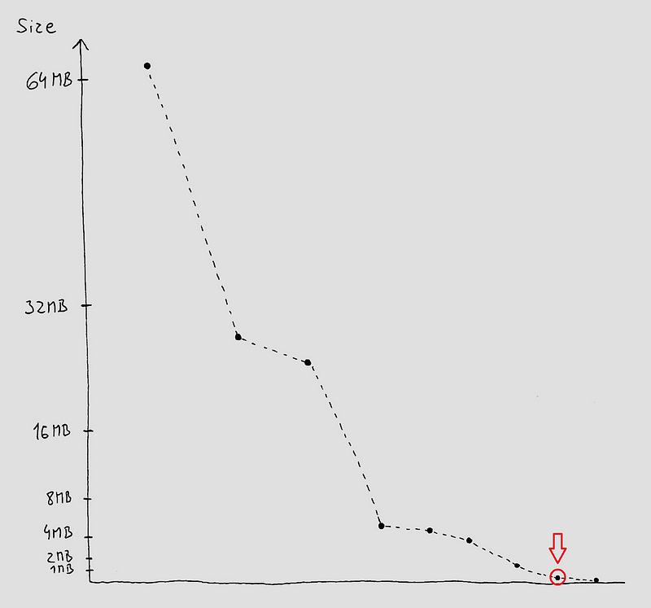

# Messing with the linker

The remaining kilobytes can be shaved off by using tricks native developers use to shrink their native apps.

We're going to:

* Disable incremental linking
* Strip relocation information
* Merge similar sections within the executable
* Set internal alignment within the executable to a small value

```sh
$ link.exe /debug:full /subsystem:console zerosnake.obj /entry:__managed__Main kernel32.lib ucrt.lib /merge:.modules=.rdata /merge:.pdata=.rdata /incremental:no /DYNAMICBASE:NO /filealign:16 /align:16
```

Success! 8176 bytes!

The game still works, and interestingly, it's still fully debuggable - feel free to open the EXE in Visual Studio (File -> Open Solution), open one of the C# files that are part of the game, set a breakpoint in it, hit F5 to launch the EXE, and see the breakpoint getting hit. You can disable optimizations in ILC to make the executable even more debuggable - just drop the --Os argument.

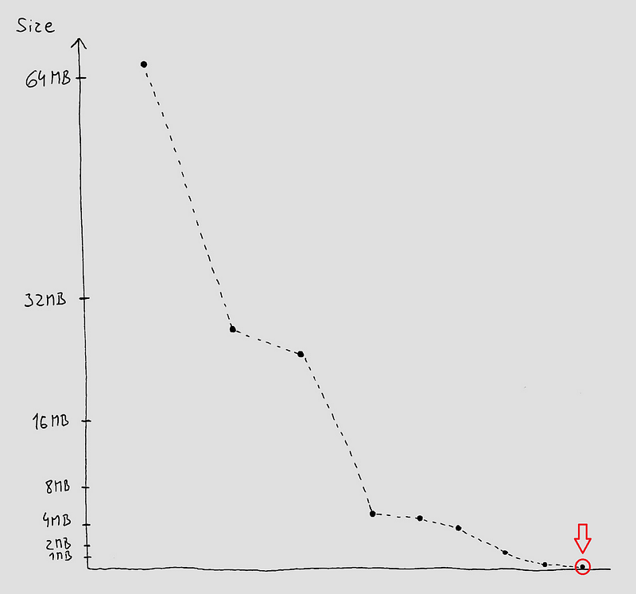

# Can we make things smaller than that?

The executable still carries some data that is not essential - the ILC compiler just doesn't expose command line options to disable their generation.

One of those data structures that gets generated but we don't need is GC information for the individual methods. CoreRT has a precise garbage collector that requires each method to describe where references to GC heap are at each instruction of the method body. Since we don't have a garbage collector in the Snake game, this data is unnecessary. Other runtimes (e.g. Mono) use a conservative garbage collector that doesn't require this data (it simply assumes any piece of the stack and CPU registers could be a GC reference) - a conservative garbage collector trades GC performance for extra size savings. The precise garbage collector used in CoreRT can operate in conservative mode too, but it hasn't been hooked up yet. It's a potential future addition that we could then leverage to make things even smaller.

Maybe one day we can make a simplified version of our game fit into a 512 byte boot sector. Until then, happy hacking!
