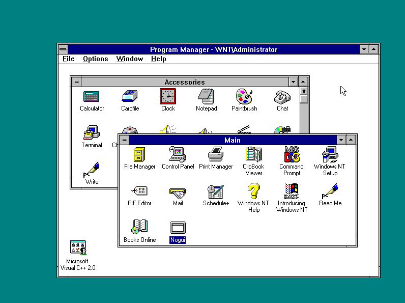
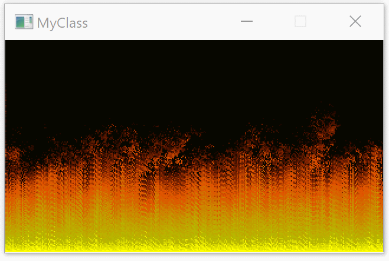
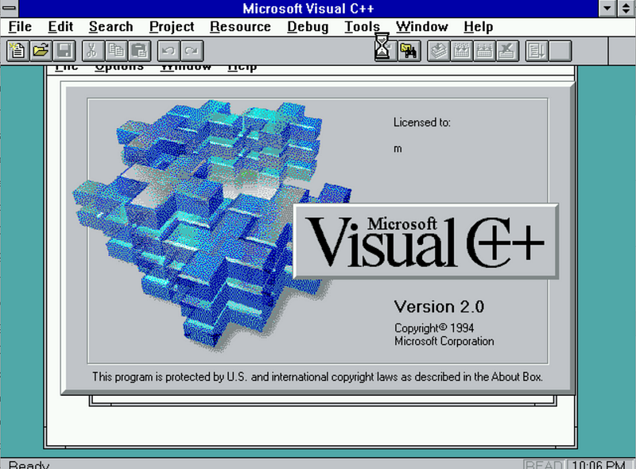
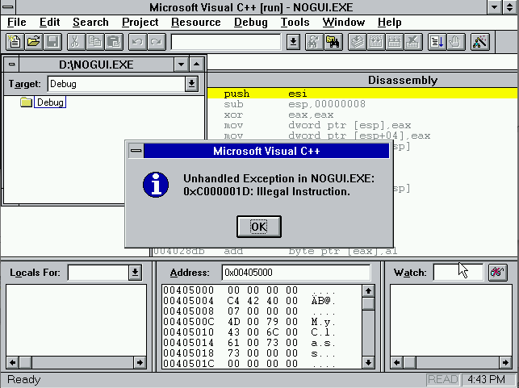
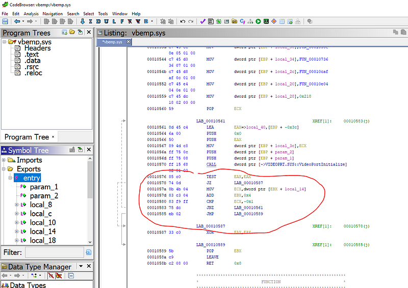
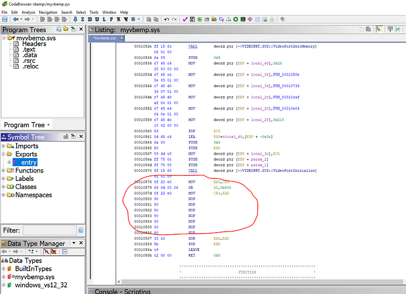
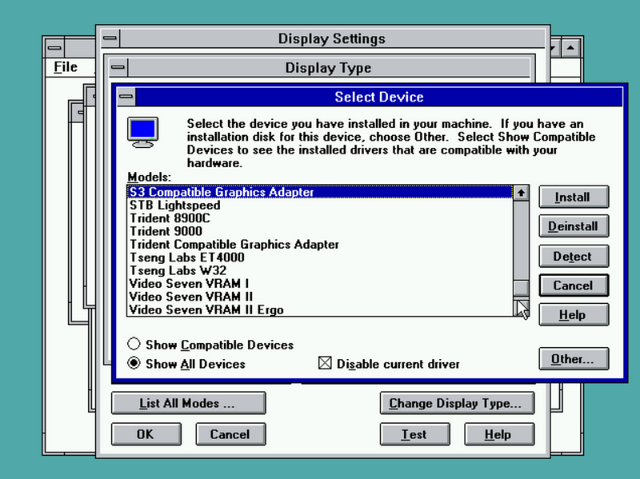
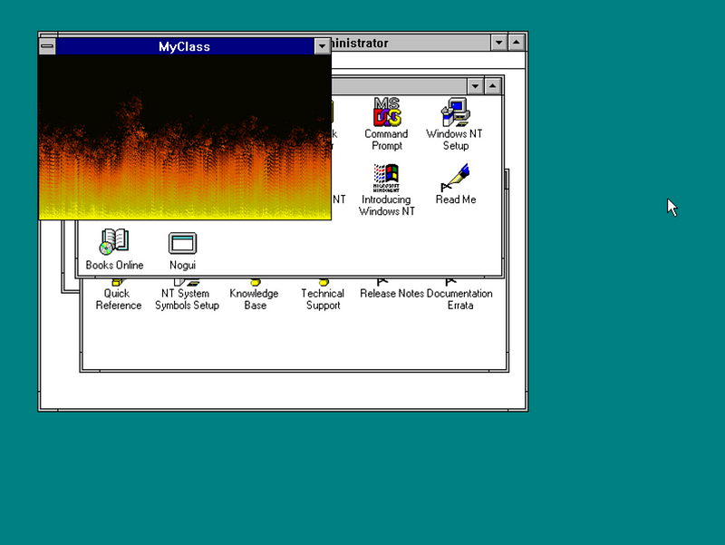

There's something deeply satisfying about making old technology do new things. When I was reading Fabien Sanglard's article about [how the DOOM fire effect was implemented](https://fabiensanglard.net/doom_fire_psx/) I wondered - can I implement this effect in a 21st century programming language and have it run on something from the DOOM era?

Turns out I can:



Windows NT 3.51 pre-dates the C# programming language by 7 years (the former introduced in 1995, the latter in 2002). It was never deemed necessary to support C# on NT 3.51 - the operating system was already out of support when C# first came out.

I already had some experience getting C# running on old operating systems, but a GUI fire effect is a bit more ambitious than a C# app that shows a message box on Windows 3.11:



Or a textmode snake game in C# that runs on MS-DOS 5.0:



C# provides a great mix of high level and low level constructs. On one end you have async, lambda functions, and LINQ expressions; on the other end you have struct, pointers, and pointer math.

The philosophy of C# is to be a high level language by default, and low level when necessary.

For these kinds of hacks, we need to stick to the low level parts - that way we can avoid porting the C# runtime. This lets us focus on the interesting logic itself. I wrote about this approach at length in my [Building a self-contained game in C# under 8 kilobytes](../8kb-game-in-c-sharp) article.

If your use case can tolerate a garbage collector, C# is probably a good choice no matter what you're building. And if you can't tolerate a garbage collector, go with Rust and learn to embrace its memory ownership model.

# Building a no-dependency Windows GUI app

The format of executable files on Windows didn't fundamentally change since Windows NT 3.1 - the first "modern" version of Windows released in 1993. If we can build a lightweight executable using tools from 2020 (by lightweight, I mean: with modern and "heavy" things removed), chances are it will run on old versions of Windows just fine.

The first step in quickly getting a C# program running in an unusual environment is to restrict the dependencies of the program so that there's as few things to port as possible.

C# and .NET comes with a selection of GUI frameworks that run on Windows and elsewhere - there's the original Windows.Forms, there's WPF, and the cross-platform Avalonia, Uno, Gtk#, and many others.

To run any of these frameworks on NT 3.51, we would need to port the frameworks to NT first. That's not exactly a couple hours of hacking - so let's turn to the common denominator of these frameworks (on Windows): the Win32 API.

The Win32 API is how Windows expects apps to talk to it irrespective of the language or framework the app is programmed in. It's what all the GUI frameworks have to call into, eventually.

Most of Win32 consists of C-style exported methods. C# allows calling C-style exports using an FFI (foreign functions interface) called P/Invoke - one just needs to declare the foreign function with its name and signature, annotate the declaration with the name of the foreign library, and the C# runtime will glue those things together allowing one to call the other seamlessly.

The Win32 API puts a lot of emphasis on backwards compatibility. If we can stick to the APIs that were available in Windows NT 3.51, the app will work on Windows NT 3.51, NT 4, 2000, XP, Vista, 7, 8, 8.1, all the way until Windows 10.

# Building a C# GUI app with Win32 APIs

To create a window with Win32 APIs, one needs to call a couple Win32 APIs to register and create a window, provide a callback that handles events, and run a message loop that dispatches events.

It's definitely not the idiomatic way to build GUI apps with C#. These stunts are done by a trained professional. Don't do this at home.

```csharp
unsafe class Program
{
    static int Main()
    {
        string className = "MyClass";
        IntPtr wnd;

        fixed (char* pClassName = className)
        {
            // C# 9.0 preview feature limitation - need to cast away the "managed" because C# doesn't yet understand
            // UnmanagedCallersOnlyAttribute
            var wndproc = (delegate* stdcall<IntPtr, uint, IntPtr, IntPtr, IntPtr>)(delegate* managed<IntPtr, uint, IntPtr, IntPtr, IntPtr>)
                &WndProc;

            //
            // Register a class that represents the window.
            //
            WNDCLASS wndClass = new WNDCLASS
            {
                lpfnWndProc = wndproc,
                lpszClassName = pClassName,
            };

            if (RegisterClassW(&wndClass) == 0)
            {
                return 1;
            }

            int dwStyle = 0x00080000 | 0x00C00000 | 0x00800000 | 0x10000000 | 0x00020000;

            //
            // Create a window of the registered class.
            //
            wnd = CreateWindowExW(0,
                pClassName,
                pClassName,
                dwStyle,
                unchecked((int)0x80000000), 0,
                640, 480, default, default, default, default);
        }

        ShowWindow(wnd, 10);

        //
        // Run the main event loop. Windows will end up calling into the WndProc
        // below to handle incoming messages.
        //
        MSG msg;
        while (GetMessageW(&msg) != BOOL.FALSE)
        {
            TranslateMessage(&msg);
            DispatchMessageW(&msg);
        }
        return 0;
    }

    //
    // Windows calls this method to handle events such as "needs to repaint", "key pressed", etc.
    // Marked as UnmanagedCallerOnly because it's not called from C# but from native code.
    //
    [UnmanagedCallersOnly]
    private static IntPtr WndProc(IntPtr hwnd, uint msg, IntPtr lParam, IntPtr wParam)
    {
        switch (msg)
        {
            case 2: /*WM_DESTROY*/
                // Quit the main loop if the window was closed.
                PostQuitMessage(0);
                break;
            default:
                //
                // By default just let the default handler handle everything.
                //
                return DefWindowProcW(hwnd, msg, lParam, wParam);
        }
        return default;
    }
}

```

The UnmanagedCallersOnly part and the function pointer syntax is a new feature slated for .NET 5 later in 2020. You'll need a preview .NET 5 SDK to build the above code. Both of these new features allow interacting with native code more seamlessly and with less overhead than existing approaches (delegates and delegate marshalling). Exactly what we need!

Using .NET 5 features on Windows NT 3.51 makes this project even more fun than it already is.



Thanks to function pointers and UnmanagedCallersOnlyAttribute, I quickly had the fire effect running as a 10 kB self-contained executable on x64 Windows 10 with no dependencies on a .NET runtime.

You can find it in [this repo](https://github.com/MichalStrehovsky/sharpfire). There's nothing special about it - just a couple raw calls into Win32 APIs and code to render the fire effect itself.

I used an experimental project called CoreRT to compile the C# app into native code; a .NET runtime would be required to run C# otherwise, and the first operating system with a .NET runtime is Windows NT 4.0. CoreRT comes with an ahead of time compiler that compiles .NET assemblies into native code.

The next step was to get this built as an x86 native app - Windows NT 3.51 only supports x86, MIPS, and Alpha and the latter two would be hard to get native C# compilers for.

# Hacking in the x86 support

I found out the hard way that UnmanagedCallersOnly doesn't yet work on x86 - there's problems with calling conventions (.NET 5 is still a preview at the time of writing this, and not complete). "Calling convention" is a protocol that method calls follow - apart from other things, a calling convention defines how parameters are passed from the callsite to the called method. x86 defines a multitude of calling conventions, but the one that's relevant to Win32 APIs is called stdcall . The stdcall calling convention prescribes that all parameters to the method are passed on the stack. The event processing method decorated as UnmanagedCallersOnly in the C# source appeared to be generated as fastcall instead. In fastcall, the first two parameters are assumed to be passed in registers. So we have Windows trying to call a method with all arguments passed on the stack, but the method expects first two parameters to be in registers instead.

There are three ways to deal with this: wait until this is implemented, implement it myself, or work around it.

While annoying, it's not impossible to just work around. The workaround involves injecting a small "thunk" that moves the first two parameters off the stack to the registers and placing the thunk between the two methods. Like this:

```csharp
// Allocate a chunk of writable and executable memory.
byte* thunk = VirtualAlloc(IntPtr.Zero, 16, 0x1000 | 0x2000, 0x40);

// Write machine code instructions that move the contents of the stack
// into CPU registers used by the fastcall calling convention.
*(thunk + 0) = 0x58; // pop eax (the return address)
*(thunk + 1) = 0x59; // pop ecx (first parameter)
*(thunk + 2) = 0x5a; // pop edx (second parameter)
*(thunk + 3) = 0x50; // push eax (the return address)
*(thunk + 4) = 0xe9; // jmp 

// Compute the address where to jump to (the C# method).
// This is a relative pointer.
byte* relPtr = (byte*)((byte*)wndproc - (thunk + 4 + 5));
*((void**)(thunk + 5)) = (void*)relPtr;

// Point the window procedure to the generated thunk
wndproc = (delegate* stdcall<IntPtr, uint, IntPtr, IntPtr, IntPtr>)thunk;
```

A small hack later and I had the app running as an x86 process.

To ensure I won't hit problems later, I preventatively used link.exe from Visual C++ 2.0 (released in 1994) to link the object file generated by the CoreRT native compiler into an EXE (instead of link.exe that comes with Visual Studio 2019).

Now it was time to boot into Windows NT 3.51 and see the rewards of my work.

# Running on Windows NT 3.51

I was fumbling around a bit trying to find a way to copy the executable into the Hyper-V virtual machine with Windows NT. I naively mounted the virtual hard disk into my Windows 10 host, only to find out that Windows 10 managed to do something to the NTFS data structures that NT 3.51 really didn't like (so much for NTFS backwards compatibility). I ended up using mksisofs on WSL to create an ISO image with the executable and mounting the ISO in the VM.

But the app didn't seem to start on Windows NT 3.51 - launching the executable wasn't doing anything observable. Seems like we need a debugger.

I was too young when Windows NT 3.51 was all the rage and I never really had to debug anything on it. But I figured that Visual C++ did exist at that time and it must have had a debugger. A native debugger will probably be as happy to debug a native C# app as it is to debug a C++ app.

A couple minutes later I had Visual C++ 2.0 up and running:



Visual C++ didn't disappoint and the trick where one opens an EXE file as a "solution" to debug the EXE without source was already present. But I wasn't happy to see the problem:



The problematic instruction was a XORPS. This processor instruction was introduced in Pentium III as part of the SSE instruction set extension in 1999. I knew the app would be using those instructions, but wasn't expecting this to be an actual problem. Operating systems usually don't care if processors add new instructions (they do care about new CPU _registers_). My processor definitely supports SSE. But SSE was a problem: I didn't know why.

I had a quick look at the RyuJIT code generator that I used to generate native code for my C# app if there's an easy way to turn off SSE generation. There obviously wasn't, because who wants to run C# on processors from the nineties in 2020 (me, obviously). I didn't want to spend time hacking that out so I started looking elsewhere.

Quick search found an article on [OSDev Wiki](https://wiki.osdev.org/SSE) (it's not the first time OSDev Wiki has been incredibly useful for me - big thank you to the maintainers!). Turns out one needs to set up a couple control registers on the CPU to enable the SSE instruction set support. CPU control registers are only modifiable from kernel mode - regular apps can't set them.

I found there is a tiny driver that can do that (intlfxsr.sys), but it only works for Windows NT 4.0. I wondered whether I would be lucky and the driver would actually be backwards compatible with NT 3.51 - but a quick look at the binary made me realize that today wasn't my happy day (it was referencing functions from NTOSKRNL that didn't exist in 3.51).

At that point I shelved the hack. This made me miss the 25 year anniversary of Windows NT 3.51 in May 2020.

# Getting SSE running on Windows NT 3.51

A couple weeks later I had a random thought on the way from the office: enabling SSE on a single processor system is literally 3 instructions - grab the control register, do a logical OR with a constant, and write the register. I don't need a driver to do that. I just need a way to execute the 3 instructions in kernel mode.

I was already planning to install a [video driver](https://bearwindows.zcm.com.au/vbemp.htm) on the system to get video that can have more than 16 colors simultaneously. Can I make the video driver also into a SSE driver?

It was time to fire up [Ghidra](https://ghidra-sre.org/) and look for spare bytes in the driver file that we can overwrite with a sequence that enables SSE.



The driver entry point (function where the driver code "starts") had a retry loop calling VideoPortInitialize. How important could a retry loop be on a virtual machine? I fired up a hex editor and replaced the retry loop with code that assumes success and enables SSE:



Luckily, Windows NT 3.51 didn't bother with things like digital signatures, so patching a driver requires nothing more than updating the checksum in the file header. Doing this kind of patching today would invalidate the digital signature on the driver and likely cause a blue screen of death. 1995 were simpler times.

Once I was done with the patching, I tried installing the driver:



I half-expected to see a blue screen of death on reboot, but instead I was greeted with a colorful logon screen.

Did my C# app work now? You bet!



One last thing that I just _had to_ try is whether the app would also work on Windows NT 3.1 - the very first version of Windows NT (despite the version number). Windows NT 3.1 is tricky to install on Hyper-V so I just grabbed a VHD someone posted online. Don't tell anyone.

Turns out NT 3.1 would require writing the app differently since at least one of the Win32 APIs the fire effect uses wasn't present in 3.1:


Maybe next time.
