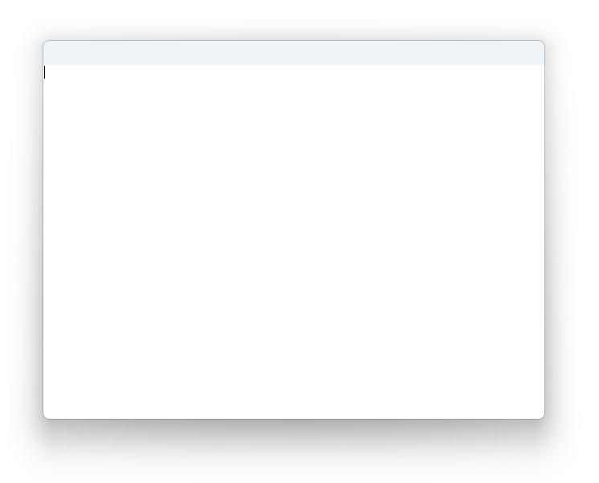
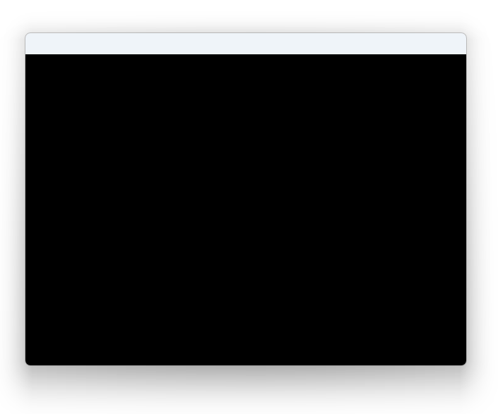

> NOTE: This is a refresh of my [4 year old article]() but with a more interesting game and a much smaller file size this time.

As someone who grew up in the times of 1.44 MB floppy disks and 56 kbit modems, I've always liked small programs. I could fit many small programs on a floppy disk I carried with me. If a program couldn't fit on my floppy disk, I started thinking about why - does it have a lot of graphics? Is there music? Can the program do many complex things? Or is it simply _bloated_?

These days, disk space became so cheap (and huge flashdrives so ubiquitous) that people gave up on optimizing for size.

One place where size still matters is transfers: when transferring a program over a wire, megabytes equate to seconds. A fast 100 MBit connection can only push through 12 megabytes per second in the best case. If on the other end of the wire is a person waiting for a download to finish, the difference between five seconds and one second can have meaningful impact on their experience.

The person could be exposed to the transfer times either directly (user is downloading a program over network), or indirectly (a serverless service is getting deployed to respond to a web request).

People typically perceive anything faster than 0.1 seconds as instant, 3 seconds is about the limit for user's flow to stay uninterrupted, and you would have a hard time to keep the user engaged after 10 seconds.

> While smaller is not essential anymore, it's still _better_.

This article came out as an experiment to find out just how small a useful self-contained C# executable can be. Can C# apps hit the sizes where users would consider the download times _instant_? Would it enable C# to be used in places where it isn't used right now?

# What exactly is "self-contained"?

A self-contained application is an application that includes everything that's necessary for it to run on a vanilla installation of the operating system.

The C# compiler belongs to a group of compilers targeting a virtual machine (Java and Kotlin being another notable members of the group): the output of the C# compiler is an executable that requires some sort of virtual machine (VM) to execute. One can't just install a barebone operating system and expect to be able to run programs produced by the C# compiler on it.

At least on Windows, it used to be the case that one could rely on a machine-wide installation of the .NET Framework to run the outputs of the C# compiler. Nowadays there are many Windows SKUs that no longer carry the framework with it (IoT, Nano Server, ARM64,…). .NET Framework also doesn't support the latest enhancements to the C# language. It's kind of on its way out.

For a C# app to be self-contained, it needs to include the runtime and all the class libraries it uses. It's a lot of stuff to fit into the 2 kB that we budget for!

# The 2 kB game

We're going to build a graphical maze game. Here's the finished product:



# The game structure

We need to start with some scaffolding so that we can push pixels to the screen. We could start with something like WinForms, but getting rid of the WinForms dependency would be the very first step in getting things smaller, so I'm going to skip it. I'm going to use some well-known sizecoding techniques (the art of building very small programs) for this. This article is not an introduction to GUI programming; I'm going to misuse things. This sizecoding-inspired scaffolding won't save us much at the beginning, but it will be essential in the last stretch.

I'm going to build with Win32 APIs to make things portable and work on Linux as well ([Win32 is the only stable ABI on Linux](https://blog.hiler.eu/win32-the-only-stable-abi/)).

We start by creating a window. Normally to create a top level window with Win32, one would first register a class with a window procedure to handle messages. We skip that and use the EDIT class, which is system-defined and normally used for textbox widgets.

```csharp
// This could also be "edit"u8, but banging it out as a little-endian numeric constant is smaller
long className = 'e' | 'd' << 8 | 'i' << 16 | 't' << 24;

IntPtr hwnd = CreateWindowExA(WS_EX_APPWINDOW | WS_EX_WINDOWEDGE, (byte*)&className, null,
    WS_VISIBLE | WS_CAPTION | WS_CLIPSIBLINGS | WS_CLIPCHILDREN,
    0, 0, Width, Height, 0, 0, 0, 0);
```

Now we only need the main loop. Every thread that owns a window needs to run a message pump so that the window can paint itself or react to things such as being dragged.

```csharp
bool done = false;
while (!done)
{
    MSG msg;
    while (PeekMessageA(&msg, 0, 0, 0, PM_REMOVE) != BOOL.FALSE)
    {
        done |= GetAsyncKeyState(VK_ESCAPE) != 0;
        DispatchMessageA(&msg);
    }
}
```

The program is now runnable and we'll see a white window with a blinking cursor when we run it:



The window can be closed by pressing the ESC key.

Now lets draw something in it. Right after the `CreateWindowExA` call, add a line to grab the device context of the window:

```csharp
IntPtr hdc = GetDC(hwnd);
```

Next declare a variable to hold our frame buffer - `Width * Height` of pixels. We'll do it a bit unconventionally so that later in optimizing, this area can be allocated within the data segment of the executable. We multiply the number of pixels by 4 to hold each component: Red, Green, Blue, and a Reserved byte.

```csharp
class Screen
{
    internal static ScreenBuffer s_buffer;
}

struct ScreenBuffer
{
    fixed byte _pixel[Width * Height * 4];
}
```

One interesting thing to call out is the `fixed byte _pixel[Width * Height * 4]` field: this is the C# syntax to declare a [fixed array](https://docs.microsoft.com/en-us/dotnet/csharp/programming-guide/unsafe-code-pointers/fixed-size-buffers). A fixed array is an array whose individual elements are a part of the struct. You can think of it as a shortcut for a set of fields `byte _pixel_0, _pixel_1, _pixel_2, _pixel_3,... _pixel_N` that one can access as an array. The size of this array needs to be a compile time constant so that the size of the entire struct is fixed.

We need to prepare one more structure: a `BITMAPINFO` structure that tells Win32 about the properties of our screen buffer:

```csharp
class BitmapInfo
{
    internal static BITMAPINFO bmi = new BITMAPINFO
    {
        bmiHeader = new BITMAPINFOHEADER
        {
            biSize = (uint)sizeof(BITMAPINFOHEADER),
            biWidth = Width,
            biHeight = -Height,
            biPlanes = 1,
            biBitCount = 32,
            biCompression = BI.RGB,
            biSizeImage = 0,
            biXPelsPerMeter = 0,
            biYPelsPerMeter = 0,
            biClrUsed = 0,
            biClrImportant = 0,
        },
        bmiColors = default
    };
}
```

We can now draw the contents of the buffer to the screen. Add following under the `PeekMessage` loop:


```csharp
fixed (BITMAPINFO* pBmi = &BitmapInfo.bmi)
fixed (ScreenBuffer* pBuffer = &Screen.s_buffer)
{
    StretchDIBits(hdc, 0, 0, Width, Height, 0, 0, Width, Height, pBuffer, pBmi, DIB_RGB_COLORS, SRCCOPY);
}
```

If you run the program now, you'll see a black window. This is because all the pixels are initialized to zero.



If you're wondering about the maze drawing logic itself, I refer you to either:
* [Lode's computer graphics tutorial](https://lodev.org/cgtutor/raycasting.html#Textured_Raycaster), or
* [The game engine black book – Wolfenstein 3D](https://fabiensanglard.net/gebb/)

I just took Lode's C++ code and translated it into C#. There's not much for me to talk about. The only change I did was noticing that moving forward is the opposite of moving backward (same for left and right). Lode's original code had extra handling for all 4 directions, but I collapsed it to 2, multiplying by -1 to get the opposite direction.

That's pretty much it. Let's see where we are in terms of size.

# The default size of a .NET 8 maze

I've placed the game in [a GitHub repo](https://github.com/MichalStrehovsky/minimaze) so that you can follow along. To produce the default (single-file) configuration with CoreCLR, run:

```
$ dotnet publish -p:PublishSingleFile=true
```

This will produce a single EXE file that is whopping 64 MB in size. The produced EXE includes the game, the .NET Runtime, and the base class libraries that are the standard part of .NET. You might say "still better than Electron" and call it good, but let's see if we can do better.


# Compression in single file

.NET single file executables can optionally be compressed. The program is still completely the same, just compressed. Let's turn the compression on:

```
$ dotnet publish -p:PublishSingleFile=true -p:EnableCompressionInSingleFile=true
```

Now we're down to 35.2 MB. Half of what we started with, but still much bigger than 2 kB.

# IL Trimming

[Trimming](https://learn.microsoft.com/en-us/dotnet/core/deploying/trimming/trim-self-contained) removes unused code from your app by scanning the entire program and removing code that is unreferenced. Trimming can break some .NET programs that use runtime reflection to look at the program structure. We don't do that, so trimming will be fine. To use trimming with the project, add a `PublishTrimmed` property. Like so:

```
$ dotnet publish -p:PublishSingleFile=true -p:EnableCompressionInSingleFile=true -p:PublishTrimmed=true
```

With this setting, the game shrinks to 10 MB. Nice, but still not even close.

# Native AOT compilation

Another option we have is to use [native AOT deployment](https://learn.microsoft.com/en-us/dotnet/core/deploying/native-aot). Native AOT deployment produces fully native executables with a runtime tailored to what the app needs. We don't need much from the runtime. Native AOT deployment implies trimming and single file, so we can drop those from the command line. There's no built in compression for native AOT either. The command line is simple:

```
$ dotnet publish -p:PublishAot=true
```

1.13 MB. Now it's starting to be interesting.

# Dropping unused framework features

Trimmed and native AOT compiled deployments offer an option to [remove unnecessary framework features](https://learn.microsoft.com/en-us/dotnet/core/deploying/trimming/trimming-options?pivots=dotnet-8-0#trimming-framework-library-features) or [optimize outputs for size](https://learn.microsoft.com/en-us/dotnet/core/deploying/native-aot/optimizing).

We're going to:

* Optimize for size
* Turn off support for pretty stack trace strings
* Enable invariant globalization
* Remove framework exception message strings

```
$ dotnet publish -p:PublishAot=true -p:OptimizationPreference=Size -p:StackTraceSupport=false -p:InvariantGlobalization=true -p:UseSystemResourceKeys=true
```

923 kB. At this point we ran out of officially supported options on .NET, but we're still 921 kB over our budget.

# bflat

[bflat](https://flattened.net) is an ahead of time compiler for C# built from parts of the official .NET SDK. At its core is a fork of the [dotnet/runtime](https://github.com/dotnet/runtime) repository with a couple opinionated changes. This is built into the bflat CLI that exposes a C# compiler that can target both IL and native code.

You can install it with `winget install bflat` to follow along.

Since bflat is built on top the real .NET, let's start where we left off, with stack trace strings removed, globalization turned off, and framework exception messages stripped:

```
$ bflat build -Os --no-stacktrace-data --no-globalization --no-exception-messages
```

882 kB. A tiny bit smaller due to opinionated changes made by bflat.

# bflat with zerolib

The [bflat compiler](https://flattened.net) allows you to choose one of three options when it comes to the runtime libraries – you can either use the full runtime library that comes with .NET, or bflat's own minimal implementation called zerolib, or no standard library at all.

|                                | DotNet | Zero | None |
|--------------------------------|:------:|:----:|:----:|
| Primitive types                | ✓      | ✓    | ✗    |
| Rich standard library          | ✓      | ✗    | ✗    |
| Marshalling-less p/invoke      | ✓      | ✓    | ✓    |
| Full p/invoke                  | ✓      | ✗    | ✗    |
| Garbage collector              | ✓      | ✗    | ✗    |
| Exception handling             | ✓      | ✗    | ✗    |
| Building apps and libraries    | ✓      | ✓    | ✓    |
| Target Linux, Windows, Android | ✓      | ✓    | ✓    |
| Target UEFI                    | ✗      | ✓    | ✓    |
| Starting app size              | 600 kB | 4 kB | ~4 kB|

We carefully crafted the game to be compatible with zerolib's restrictions. Let's switch to zerolib.

```
$ bflat build -Os --stdlib:zero
```

9 kB! We're getting close!

# Direct pinvoke

One thing you'll notice if you open the produced executable in a hex editor is calls to `LoadLibrary` and `GetProcAddress` that we didn't have in the original program. This is because bflat by default resolves p/invoke calls to gdi32.dll and user32.dll lazily. Let's instruct bflat to resolve them statically:

```
$ bflat build -Os --stdlib:zero -i gdi32 -i user32
```

Uh-oh, it doesn't quite work:

```
lld: error: undefined symbol: StretchDIBits
>>> referenced by D:\git\minimaze\Program.cs:262
>>>               D:\git\minimaze\minimaze.obj:(minimaze_Program__Main)
```

This is because bflat doesn't come with import libraries for all of Windows, only the subset it needs.

We can fix this by pointing bflat's linker to the import libraries in the Windows SDK:

```
$ bflat build -Os --stdlib:zero -i gdi32 -i user32 --ldflags C:\Progra~2\WI3CF2~1\10\Lib\10.0.22621.0\um\x64\gdi32.lib
```

Success! We're down to 8 kB.

# Debugging support and relocations

Looking at the output executable in a hex editor some more, we'll see two more things:

* A `.reloc` section. This section contains information necessary to fix up the executable if it wasn't loaded at its preferred base address (e.g. due to ASLR)
* A path to the PDB file. This is used by the debugger to find the file.

We don't need either. bflat has switches to get rid of them:

```
$ bflat build -Os --stdlib:zero -i gdi32 -i user32 --ldflags C:\Progra~2\WI3CF2~1\10\Lib\10.0.22621.0\um\x64\gdi32.lib --no-pie --no-debug-info
```

We're at 7 kB now.

# Building for x86

So far we've been building for the x86-64 architecture. This architecture is a compatible binary extension of the x86 architecture. Being an extension, the instruction encoding is bigger, and so are pointers. Let's switch to x86.

```
$ bflat build -Os --stdlib:zero -i gdi32 -i user32 --ldflags C:\Progra~2\WI3CF2~1\10\Lib\10.0.22621.0\um\x86\gdi32.lib --no-pie --no-debug-info -arch x86
```

(Notice I also swapped the path to the gdi32.lib file to point to the x86 version.)

6.5 kB. At this point we ran out of bflat compiler switches.

# Crinkler

Building native executables typically consists of two steps: generating an object file that has machine code, but it's not actually runnable yet, and running a linker to produce the executable from the object file.

So far, we've been using bflat's linker (which is really just a packaged [LLD](https://lld.llvm.org/), the LLVM linker).

There is however a specialized linker used by people who do sizecoding: [crinkler](https://github.com/runestubbe/Crinkler). Crinkler is a compressing linker for Windows, specifically targeted towards executables with a size of just a few kilobytes. Let's try using crinkler with this.

First, we need to find the command line switches to invoke the linker. To see how bflat runs the LLVM linker, append `-x` command line switch to `bflat build`:

```
$ bflat build -Os --stdlib:zero -i gdi32 -i user32 --ldflags C:\Progra~2\WI3CF2~1\10\Lib\10.0.22621.0\um\x64\gdi32.lib --no-pie --no-debug-info -arch x86 -x
```

This will print a line that looks like this:

```
C:\Users\michals\AppData\Local\Microsoft\WinGet\Packages\MichalStrehovsky.bflat_Microsoft.Winget.Source_8wekyb3d8bbwe\bin\lld.exe -flavor link "D:\git\minimaze\minimaze.obj" /out:"D:\git\minimaze\minimaze.exe" /libpath:"C:\Users\michals\AppData\Local\Microsoft\WinGet\Packages\MichalStrehovsky.bflat_Microsoft.Winget.Source_8wekyb3d8bbwe\lib\windows\x86" /libpath:"C:\Users\michals\AppData\Local\Microsoft\WinGet\Packages\MichalStrehovsky.bflat_Microsoft.Winget.Source_8wekyb3d8bbwe\lib\windows" /libpath:"C:\Users\michals\AppData\Local\Microsoft\WinGet\Packages\MichalStrehovsky.bflat_Microsoft.Winget.Source_8wekyb3d8bbwe\lib" /subsystem:console /entry:__managed__Main /fixed /incremental:no /merge:.modules=.rdata /merge:.managedcode=.text advapi32.lib bcrypt.lib crypt32.lib iphlpapi.lib kernel32.lib mswsock.lib ncrypt.lib normaliz.lib  ntdll.lib ole32.lib oleaut32.lib user32.lib version.lib ws2_32.lib shell32.lib Secur32.Lib /opt:ref,icf /nodefaultlib:libcpmt.lib C:\Progra~2\WI3CF2~1\10\Lib\10.0.22621.0\um\x86\gdi32.lib C:\Progra~2\WI3CF2~1\10\Lib\10.0.22621.0\um\x86\user32.lib C:\Users\michals\AppData\Local\Microsoft\WinGet\Packages\MichalStrehovsky.bflat_Microsoft.Winget.Source_8wekyb3d8bbwe\lib\windows\x86\zerolibnative.obj
```

We'll take note of this for later.

Next we need the object file. bflat typically deletes the object file after creating the EXE file but we can instruct it to stop after generating the obj file by appending `-c` to `bflat build`:

```
$ bflat build -Os --stdlib:zero -i gdi32 -i user32 --ldflags C:\Progra~2\WI3CF2~1\10\Lib\10.0.22621.0\um\x64\gdi32.lib --no-pie --no-debug-info -arch x86 -c
```

Now we have minimaze.obj. Let's run crinkler. We will pass a couple arguments that we found in the step above:

* name of the input object file
* name of the output executable
* name of the entry point symbol (`__managed__Main`)
* paths to kernel32.lib, user32.lib, gdi32.lib
* path to zerolibnative.obj (an implementation detail of bflat's zerolib)

```
$ crinkler minimaze.obj /out:minimaze-crinkled.exe /entry:__managed__Main C:\Progra~2\WI3CF2~1\10\Lib\10.0.22621.0\um\x86\user32.lib C:\Progra~2\WI3CF2~1\10\Lib\10.0.22621.0\um\x86\kernel32.lib C:\Progra~2\WI3CF2~1\10\Lib\10.0.22621.0\um\x86\gdi32.lib C:\Users\michals\AppData\Local\Microsoft\WinGet\Packages\MichalStrehovsky.bflat_Microsoft.Winget.Source_8wekyb3d8bbwe\lib\windows\x86\zerolibnative.obj /subsystem:windows
```

1,936 bytes! It's now small enough we can encode the contents of the EXE into a QR code (with a decent amount of error correction as well):

```
qrencode -r minimaze-crinkled.exe -l M -o minimaze-crinkled.png -8
```


If you scan the above QR code with a reader, you should get the game's executable data. You can try scanning it and running the game.

If you're interested in learning more about sizecoding, I recommend the [in4k site](https://in4k.github.io/wiki/about) - even though most resources focus on C and C++, they translate easily to C# as well. What game can you fit in 4 kB? What can you do in 8 kB?
