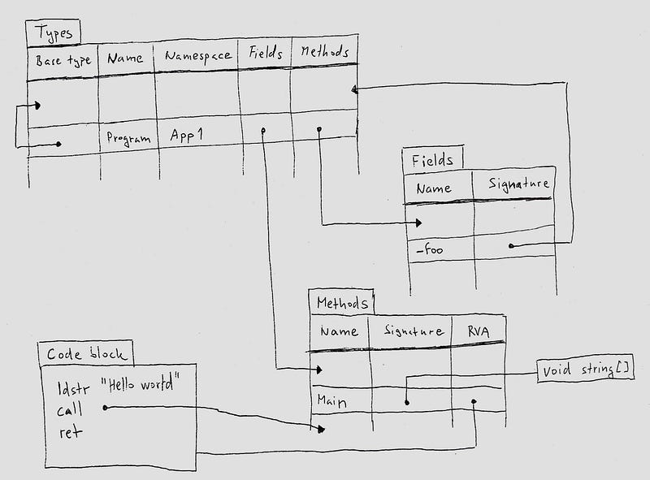
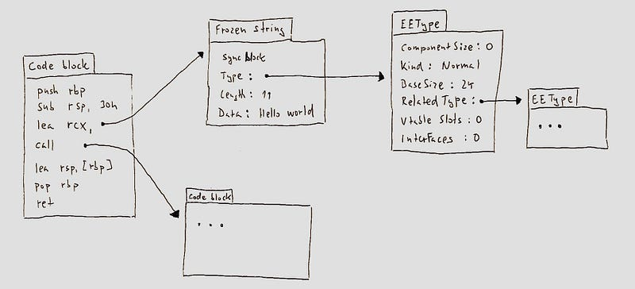
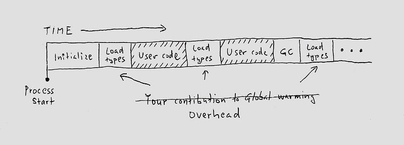
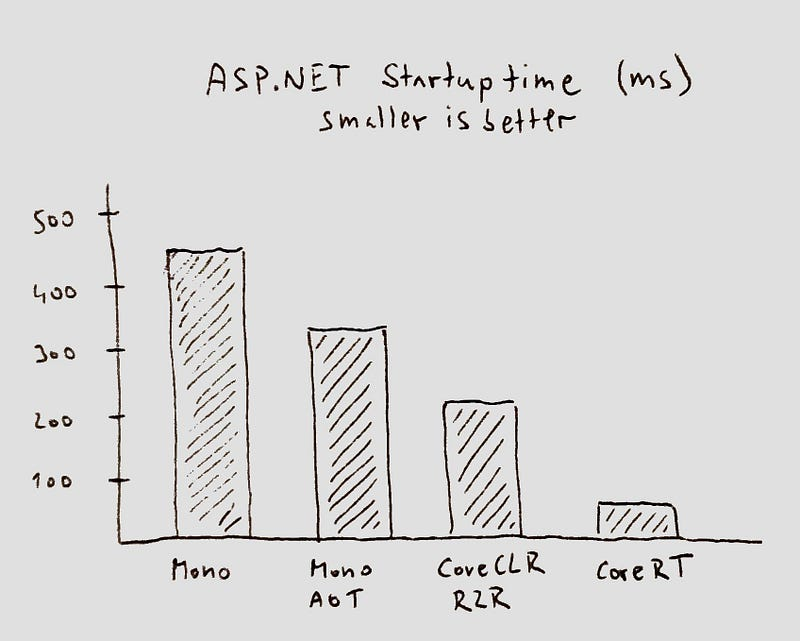
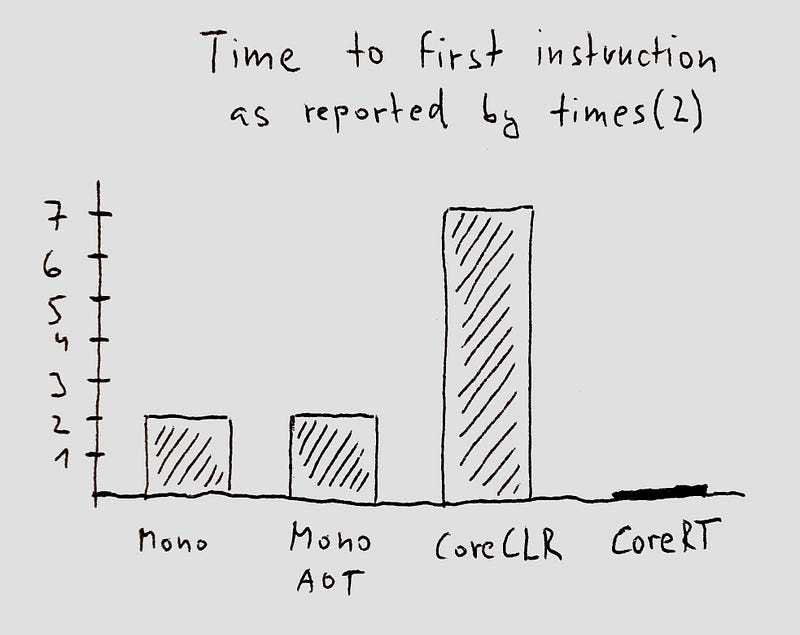
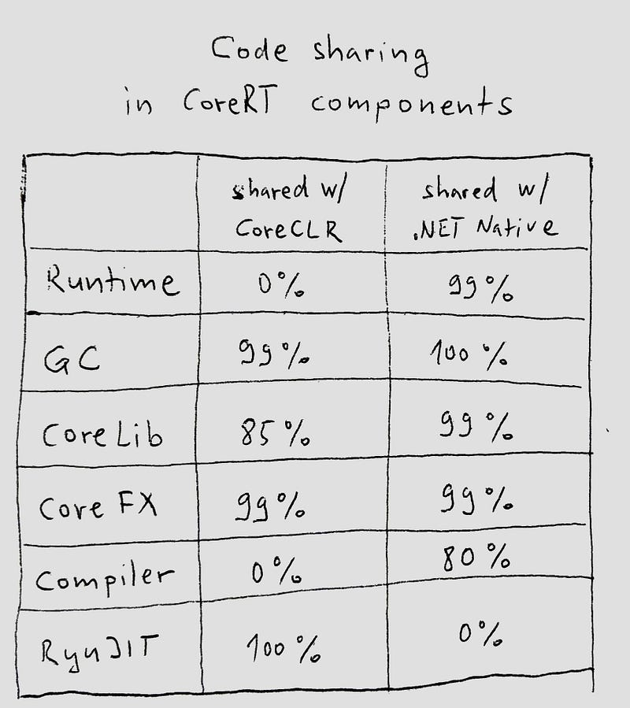

> NOTE: This article captures a point in time in the past. While the general information is still correct, the CoreRT project got folded into [Native AOT publishing](https://learn.microsoft.com/dotnet/core/deploying/native-aot/) in .NET 7 and is now a supported part of .NET. The information about sizes is no longer accurate (and much better), neither is the information about support for dynamic code (both interpreter and JIT are unsupported).

Ahead of time compilation (AOT) has been part of .NET ever since v1 of .NET framework came out. .NET framework had a technology called NGEN that allowed pre-generating native code and data structures at the time of installing a .NET program into the global assembly cache. NGEN created a cache of code and data structures the runtime would require to run the installed program. The cache was not complete — the runtime would fall back to doing just in time (JIT) compilation and loading when needed, but a great chunk of typical apps could be compiled ahead of time this way.

The Mono runtime (synonym for Xamarin for many) then stretched this caching approach further, making it possible to run without any just in time code generation at runtime. Mono achieved this by making more investments into pre-generating code for generics and various stubs that NGEN left out.

While this can be called ahead of time compilation in a way, it is quite different from how C, Go, Swift, or Rust are compiled ahead of time. The implementation of AOT compilation in the mainstream .NET runtimes leaves a lot of the AOT benefits on the table. This article will explore those benefits.

## JIT vs AOT

A common misconception is that the only difference between just-in-time and ahead-of-time runtimes is in the timing of native code generation. A JIT-compiling runtime will generate native code on demand — when your app is deployed and running in the target environment. An AOT-compiling runtime pre-generates native code as part of the app build.

The source of this misconception lies in how the mainstream runtimes implemented ahead of time compilation in the past: add native code to a .NET assembly and call it good. An AOT compiler can do more than that.

Before we dig into the details, let's look at the life of a C# app.

## .NET application lifecycle

When the C# compiler compiles your source code, it generates IL assemblies. An IL assembly is an EXE or DLL file whose contents is split in two categories: code of your app in CIL (machine code for an abstract processor), and metadata about your code (names of types, their base class, interfaces, methods, fields, etc.).

The metadata looks very much like a set of database tables with information about the types, fields and methods defined within the module, but also references to types, fields and methods defined in other IL modules. Following schematic captures the gist of it:

The advantages of the IL format are twofold:

* It's independent of the hardware or OS the code will run on, and
* It has great version resiliency

The version resiliency comes from the fact that CIL is a pretty high level intermediate language — it has instructions such as "load field X on type Y", or "call method U on type V". The details of what these instructions perform is encoded in the metadata.

The richness of the metadata also means that a type can declare it derives from a type named `List` in namespace `System.Collections` in assembly `System.Collections` and the resolution of what that means will happen at runtime, by looking up the name in the `System.Collections` assembly. The definition of the base type can change (e.g. new methods and fields can be added), without requiring recompilation of an assembly that defines a type deriving from it.

The IL format captures your program at a very high level. If you ever used a tool like ILSpy, you probably saw that it can generate a near-perfect C# source code out of IL assemblies. IL format is close to being just a binary encoding of the source file.

## What's missing in an IL assembly

It's also interesting to have a look at what an IL assembly does not have. You will not find these things in an IL assembly generated by the C# compiler:

* Machine code for a specific CPU architecture: the IL instructions cannot be directly executed on any processor. They have to be interpreted or compiled.
* Data structures that would allow _efficient_ execution of the program.

The second point might require a bit of explanation. While knowing the list of fields and their names on a type is nice, when we want to e.g. allocate a new instance of this type on the GC heap (using the `new` keyword in C#), we need to know the size of the type in bytes. This can be calculated by going over the list of fields, computing the sizes of the field's types (potentially recursively), and doing the same for the base classes. This is a lot of work — a lot of it involves looking up names of things across many assemblies.

A just-in-time compiled .NET runtime will typically have a step called "type loading" where it builds an alternative representation of each type into a runtime allocated data structure. At that stage it will compute the information necessary to effectively execute the program: besides the size of the type, it will include information such as the list of offsets within instances of the given type that contain GC pointers (needed for the GC), or a table of virtual methods implemented by the type (needed for virtual calls). The runtime allocated data structure will also have a pointer back to the IL metadata to access some rarely used things.

## Not all AOT is equal

From this, it's quite clear that it's not just the code, but also the representation of metadata in an IL assembly that is different from what we need at runtime. The file format of the IL assembly is not what we would come up with if AOT compilation was our objective. None of the traditionally AOT compiled languages represent their data structures this way.

The fact that the mainstream .NET runtimes use the IL format metadata even in AOT mode makes sense from an evolutionary perspective: these runtimes are built around the concepts represented in the IL metadata because they started as just-in-time runtimes. Building a cache for the most expensive thing (code) is a logical evolutionary step that doesn't require a major overhaul of the runtime.

Keeping the IL format comes with costs though. The IL file formats are built for hardware independency and version resilience. By pre-generating code ahead of time, we're giving up on these aspects, so why are we keeping the existing formats?

When the .NET runtime team started looking in this direction some 11 years ago for the [Redhawk project](https://www.zdnet.com/article/on-the-road-to-midori-redhawk-minsafe-and-sapphire/), it was clear that evolving the existing CLR runtime into a form that is optimized for AOT would be prohibitively expensive. A new runtime optimized for AOT was born.

## A .NET Runtime for AOT

Redhawk project picked up reusable parts of the CLR (such as the garbage collector — see references to FEATURE_REDHAWK in the CoreCLR's GC source code) and built a minimal runtime around it. This minimal runtime built for the Redhawk project later became the basis of .NET Native and CoreRT. You can still find references to Redhawk in the CoreRT source tree on GitHub.

When .NET Native [was announced](https://devblogs.microsoft.com/dotnet/announcing-net-native-preview/), it brought 60% gains in startup time over NGEN. These startup time improvements were made possible by using a runtime and file formats optimized for ahead of time compilation.

Remember the schematic for how programs are represented in an IL assembly? This is how they look like in CoreRT after ahead of time compilation:

You'll notice that things like the list of methods on a type and names of types no longer exist in this format. This is because they're not actually needed when the program is compiled ahead of time. The real (non-abstract) CPUs only care about code — they don't care what type a method belongs to. They also don't care how many fields a type has — they just access a piece of memory at a particular offset.

The minimal data structures in the schematic — such as the EEType structure describing the System.String type, contain the minimal amount of data required to run a .NET program. E.g. the RelatedType field on the EEType makes it possible to cast an instance of System.String to System.Object. Vtable slots support virtual method calls. BaseSize supports object allocation and garbage collection.

Decompiling a program in this representation into its source form poses the same level of complexity as e.g. decompiling C++.

The data structures that this minimal .NET runtime operates on are in fact very similar to the data structures a C++ runtime library would operate on — and so is the size of the runtime. In the [minimal configuration](https://github.com/MichalStrehovsky/zerosharp), CoreRT can compile to a ~400 kB self-contained executable that includes the full runtime and garbage collector (the size data is for x64 — the 32bit targets can actually be smaller than that). The GC used in this configuration is still the same GC that handles gigabyte workloads in Azure.

## Startup time

The main performance benefit of ahead of time compilation comes in the form of startup time. A just-in-time runtime (or an AOT runtime built around IL format) will spend considerable amount of time doing things that support running your program, but not actually running your code. The startup path will look something like this:

The 60% startup time improvement that was observed for Universal Windows Apps with .NET Native translates to other workload types as well. Here is how startup times look like for ASP.NET with [a benchmark](https://github.com/brianrob/tests/tree/b953d32584441c7476b7daab24fc1afc70b52ff4/managed/aspnet_start) the CoreCLR performance team uses:

Now, startup time doesn't matter much if your process is long-running — like a web server. It starts to matter when end users are exposed to the delay: startup time is the time when users stare at the hourglass cursor in a desktop app, app load splash screen in a mobile app, or empty webpage in a web app.

## Time to first user instruction

An interesting metric is how long it takes from the process creation time until the first line of your Main() executes. A lot of things need to happen before a runtime can execute the first line of your code. This is actually quite simple to measure if you only need a ballpark number — place a call to the [times](https://linux.die.net/man/2/times) (on Linux) or [GetProcessTimes](https://docs.microsoft.com/en-us/windows/desktop/api/processthreadsapi/nf-processthreadsapi-getprocesstimes) (on Windows) API as the first line of your Main().

This API gives you information about how much work the framework did before it got around to executing the first line of your program. For languages like C, this number will typically be 0 — the first line of your program will run before the OS gets the chance to update the statistics. If you're building command line apps you'll want this number to be 0. These numbers [add up](https://mail.python.org/pipermail/python-dev/2018-May/153296.html).

Here's how time to first instruction looks like for various .NET runtimes:

The number for CoreRT is zero. Your app starts as fast as an app written in C.

## Compilation output sizes

Big difference between JIT and AOT runtimes is in sizes of the self-contained deployments. CoreRT benefits from the fact that most of what is considered "the runtime" in other .NET runtimes (and gets written in C/C++), is actually written in C# on CoreRT. Managed code can be linked away if the app doesn't use it. For traditional runtimes, the runtime part represents fixed cost that cannot be tailored for each app. Thanks to this setup, AOT deployments can be significantly smaller:

## What about reflection?

Things get interesting with reflection. While the CPU doesn't care how you name your methods and an AOT compiler is free not to emit this information, the reflection APIs make it possible to locate any type, method or field by name, and provide access to extra information about these entities, such as the signature of the method, or names of the method parameters.

The CoreRT compiler solves this problem by storing reflection information on the side — the information is not necessary to run the program, and the emission of it is optional. We can call this extra data "reflection tax". An AOT compiler can let you avoid paying it if you're not using it.

Without the reflection data, the reflection experience becomes limited: one can still use typeof, call Object.GetType(), inspect base types and implemented interfaces (because the runtime still needs it to make casting work), but list of methods and fields, or the type names become invisible.

Reflection tax is an unexplored territory in .NET: since neither CoreCLR nor Mono can operate without IL metadata, omitting the metadata is not an option for mainstream runtimes. But this might be the door to sub-megabyte deployment sizes that is especially important for targets like WebAssembly.

Traditionally ahead of time compiled languages don't have the unrestricted reflection that .NET provides and they prove that you can get work done without making everything available for reflection. A lot of things that people use reflection for these days (like serialization and deserialization) can be done without reflection — in a build task, at compile time. Doing this in a build task actually provides benefits for just-in-time runtimes too because reflection is slow.

## How about dynamic code?

.NET provides several facilities that let you generate new code at runtime. Be it Reflection.Emit, Assembly.LoadFrom, or even something as simple as MakeGenericType and MakeGenericMethod. This poses a challenge for an AOT runtime because these things cannot be done ahead of time by definition (or at least cannot be done for all programs).

This is where the AOT runtime is forced to do just-in-time loading as well. The important things is that in an AOT-first runtime, one only needs to pay the just-in-time costs if they explicitly use the dynamic features: don't call the dynamic APIs, and there's no runtime overhead.

CoreRT currently has a [prototype interpreter](https://github.com/dotnet/corert/pull/6182) and a [prototype JIT](https://github.com/dotnet/corert/pull/6327) showing that dynamic code is not a limiting factor for a runtime designed for AOT.

## So what is CoreRT anyway?

[CoreRT](https://github.com/dotnet/corert) is an experimental cross-platform open source .NET runtime specialized for AOT compilation. While CoreRT (as a whole) has an "[experimental](https://github.com/dotnet/corert/issues/7200)" label, many of the parts of CoreRT are shipping in supported products. CoreRT takes parts of .NET Native and parts of CoreCLR and puts them together. The rough percentage of things CoreRT shares with CoreCLR and .NET Native are in the picture to the left.

Thanks to this setup, CoreRT gets improved every time someone improves CoreLib in CoreCLR, or implements a new optimization in RyuJIT.

If you would like to give CoreRT a try, you can publish your .NET Core app with CoreRT by simply adding a new NuGet package reference. Instructions for that are [here](https://github.com/dotnet/corert/tree/master/samples/HelloWorld).

## JIT is to AOT as gasoline engine is to an electric engine

The performance characteristics of ahead of time compiled and just in time compiled runtimes can be compared to the characteristics of an electric and gasoline engine in a car.

* Electric motors generate motion, not heat. A just-in-time compiled .NET app will spend considerable amount of resources doing things that support running your code, but not actually running your code.
* At lower speed, electric motors deliver more torque than gasoline engines. This makes them much better at acceleration. In an AOT compiled app, peak throughput is available immediately and your app is running at full speed right away. Gasoline engine will outperform an electric engine eventually, and so will a high-octane, just-in-time compiled runtime.
* Electric motors are simpler. If one looks at a high-octane, just-in-time compiled runtime with dynamic recompilation, tiered JITting, and on stack replacement, lots of complexities start to show up. These complexities make things harder for the developer of the runtime, but also for the user of the runtime. The flavor of the native code running in production depends on the dynamic tuning the runtime performed based on the past characteristics of the program.

Both gasoline and electric engines have their use and place. It's nice to have options available and it's good that .NET has them.
